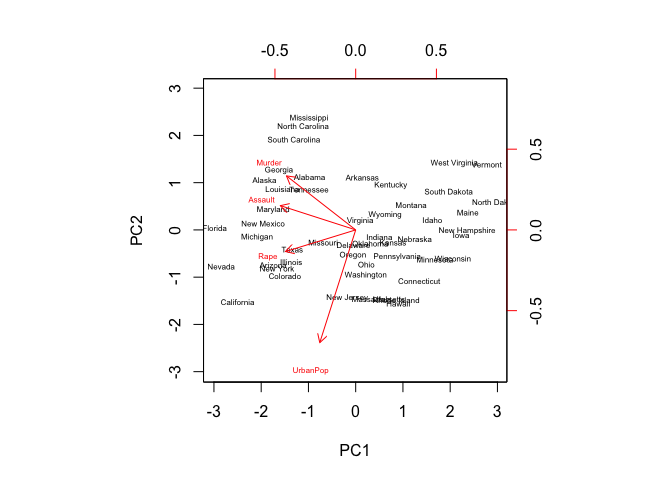
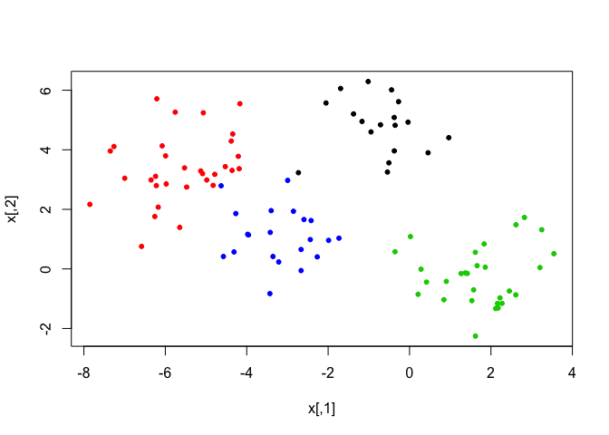
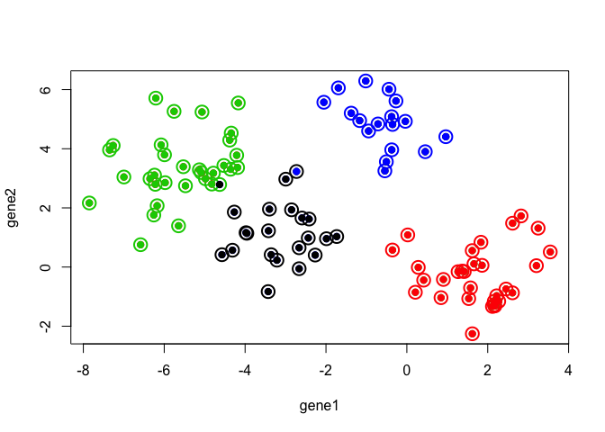
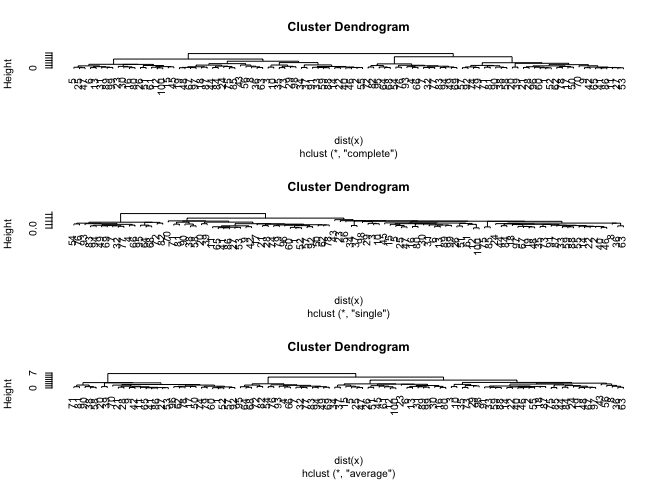
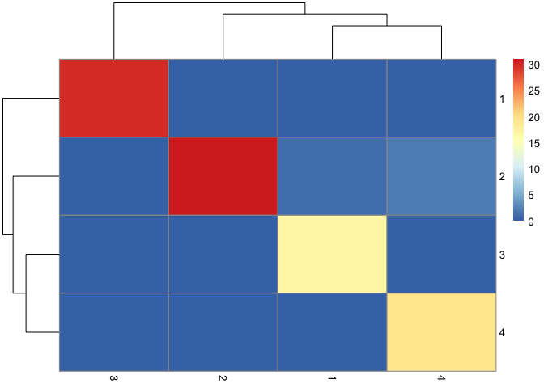
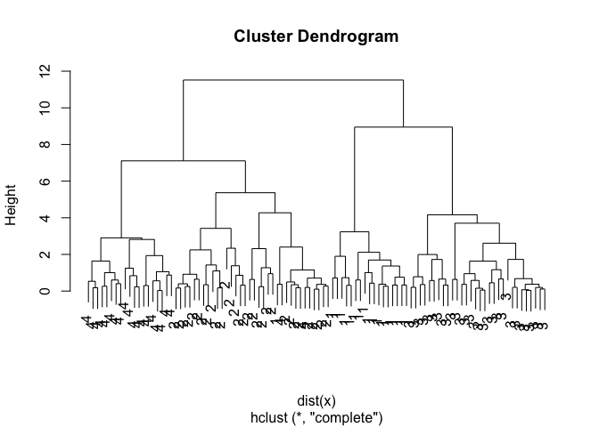
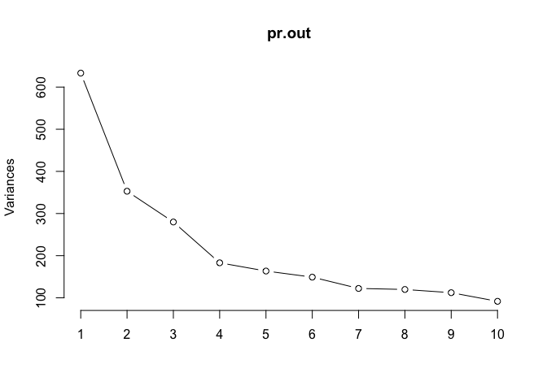
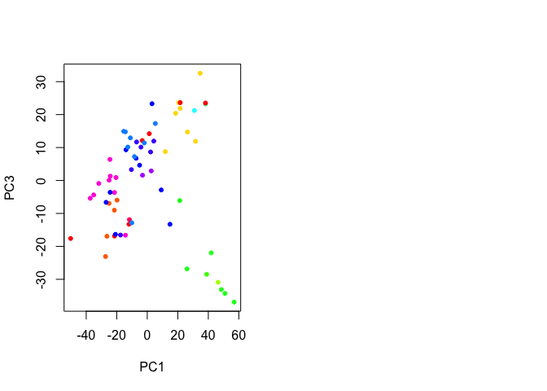

10.unsupervised
================

# Principal Components

We will use the `USArrests` data

``` r
dimnames(USArrests)
```

    ## [[1]]
    ##  [1] "Alabama"        "Alaska"         "Arizona"        "Arkansas"      
    ##  [5] "California"     "Colorado"       "Connecticut"    "Delaware"      
    ##  [9] "Florida"        "Georgia"        "Hawaii"         "Idaho"         
    ## [13] "Illinois"       "Indiana"        "Iowa"           "Kansas"        
    ## [17] "Kentucky"       "Louisiana"      "Maine"          "Maryland"      
    ## [21] "Massachusetts"  "Michigan"       "Minnesota"      "Mississippi"   
    ## [25] "Missouri"       "Montana"        "Nebraska"       "Nevada"        
    ## [29] "New Hampshire"  "New Jersey"     "New Mexico"     "New York"      
    ## [33] "North Carolina" "North Dakota"   "Ohio"           "Oklahoma"      
    ## [37] "Oregon"         "Pennsylvania"   "Rhode Island"   "South Carolina"
    ## [41] "South Dakota"   "Tennessee"      "Texas"          "Utah"          
    ## [45] "Vermont"        "Virginia"       "Washington"     "West Virginia" 
    ## [49] "Wisconsin"      "Wyoming"       
    ## 
    ## [[2]]
    ## [1] "Murder"   "Assault"  "UrbanPop" "Rape"

``` r
arrmean <-  apply(USArrests,2,mean)
apply(USArrests,2, var)
```

    ##     Murder    Assault   UrbanPop       Rape 
    ##   18.97047 6945.16571  209.51878   87.72916

We see that `Assault` has a much larger variance than the other
variables. It would dominate the principal components, so we choose to
standardize the variables when we perform PCA

``` r
pca.out=prcomp(USArrests, scale=TRUE, center = T)
pca.out
```

    ## Standard deviations (1, .., p=4):
    ## [1] 1.5748783 0.9948694 0.5971291 0.4164494
    ## 
    ## Rotation (n x k) = (4 x 4):
    ##                 PC1        PC2        PC3         PC4
    ## Murder   -0.5358995  0.4181809 -0.3412327  0.64922780
    ## Assault  -0.5831836  0.1879856 -0.2681484 -0.74340748
    ## UrbanPop -0.2781909 -0.8728062 -0.3780158  0.13387773
    ## Rape     -0.5434321 -0.1673186  0.8177779  0.08902432

``` r
names(pca.out)
```

    ## [1] "sdev"     "rotation" "center"   "scale"    "x"

``` r
biplot(pca.out, scale=0, cex=0.5)
```

<!-- -->

# K-Means Clustering

K-means works in any dimension, but is most fun to demonstrate in two,
because we can plot pictures. Lets make some data with clusters. We do
this by shifting the means of the points around.

``` r
set.seed(101)
x=matrix(rnorm(100*2),100,2)
xmean=matrix(rnorm(8,sd=4),4,2)
which=sample(1:4,100,replace=TRUE)
x=x+xmean[which,]
```

``` r
plot(x,col=which,pch=20)
```

<!-- -->

We know the “true” cluster IDs, but we wont tell that to the `kmeans`
algorithm.

``` r
x <-  as.data.frame(x) 
colnames(x) = c("gene1", "gene2")


km.out=kmeans(x,4,nstart=15)

plot(x,col=km.out$cluster,cex=2,pch=1,lwd=2)
points(x,col=which,pch=19)
points(x,col=c(4,3,2,1)[which],pch=19)
```

<!-- -->

``` r
km.out
```

    ## K-means clustering with 4 clusters of sizes 21, 30, 32, 17
    ## 
    ## Cluster means:
    ##        gene1      gene2
    ## 1 -3.1068542  1.1213302
    ## 2  1.7226318 -0.2584919
    ## 3 -5.5818142  3.3684991
    ## 4 -0.6148368  4.8861032
    ## 
    ## Clustering vector:
    ##   [1] 2 3 3 4 1 1 4 3 2 3 2 1 1 3 1 1 2 3 3 2 2 3 1 3 1 1 2 2 3 1 1 4 3 1 3
    ##  [36] 3 1 2 2 3 2 2 3 3 1 3 1 3 4 2 1 2 2 4 3 3 2 2 3 2 1 2 3 4 2 4 3 4 4 2
    ##  [71] 2 4 3 2 3 4 4 2 2 1 2 4 4 3 3 2 3 3 1 2 3 2 4 4 4 2 3 3 1 1
    ## 
    ## Within cluster sum of squares by cluster:
    ## [1] 30.82790 54.48008 71.98228 21.04952
    ##  (between_SS / total_SS =  87.6 %)
    ## 
    ## Available components:
    ## 
    ## [1] "cluster"      "centers"      "totss"        "withinss"    
    ## [5] "tot.withinss" "betweenss"    "size"         "iter"        
    ## [9] "ifault"

# Hierarchical Clustering

We will use these same data and use hierarchical clustering

WE know there are 4 clusters so there should be 4 rather big arms of the
dedrogram tree.

``` r
# complete linkage  
hc.complete <- hclust(dist(x),method="complete")


# single linkage  looks like it finds 3 clusters. 
hc.single=hclust(dist(x),method="single")


# Average linkage. Average is somewhere in between. 
hc.average=hclust(dist(x),method="average")


par(mfrow=c(3,1))
plot(hc.complete)
plot(hc.single)
plot(hc.average)
```

<!-- --> Lets
compare this with the actualy clusters in the data. We will use the
function `cutree` to cut the tree at level 4. This will produce a vector
of numbers from 1 to 4, saying which branch each observation is on. You
will sometimes see pretty plots where the leaves of the dendrogram are
colored. I searched a bit on the web for how to do this, and its a
little too complicated for this demonstration.

We can use `table` to see how well they match:

``` r
library(pheatmap)
# Cut the complete linkage tree at level 4: 
hc.cut <- cutree(hc.complete,4)
pheatmap(table(hc.cut,which))
```

<!-- -->

``` r
table(hc.cut,km.out$cluster)
```

    ##       
    ## hc.cut  1  2  3  4
    ##      1  0 30  0  0
    ##      2  2  0 32  0
    ##      3  0  0  0 17
    ##      4 19  0  0  0

or we can use our group membership as labels for the leaves of the
dendrogram:

``` r
plot(hc.complete,labels=which)
```

<!-- -->

NCI60 data.

``` r
require(ISLR)
```

    ## Loading required package: ISLR

``` r
class(NCI60)
```

    ## [1] "list"

``` r
str(NCI60)
```

    ## List of 2
    ##  $ data: num [1:64, 1:6830] 0.3 0.68 0.94 0.28 0.485 ...
    ##   ..- attr(*, "dimnames")=List of 2
    ##   .. ..$ : chr [1:64] "V1" "V2" "V3" "V4" ...
    ##   .. ..$ : chr [1:6830] "1" "2" "3" "4" ...
    ##  $ labs: chr [1:64] "CNS" "CNS" "CNS" "RENAL" ...

``` r
NCI60$data[1:4,1:4]
```

    ##           1         2         3         4
    ## V1 0.300000  1.180000  0.550000  1.140000
    ## V2 0.679961  1.289961  0.169961  0.379961
    ## V3 0.940000 -0.040000 -0.170000 -0.040000
    ## V4 0.280000 -0.310000  0.680000 -0.810000

``` r
nci.labs <- NCI60$labs
nci.data <- NCI60$data

levels(factor(nci.labs))
```

    ##  [1] "BREAST"      "CNS"         "COLON"       "K562A-repro" "K562B-repro"
    ##  [6] "LEUKEMIA"    "MCF7A-repro" "MCF7D-repro" "MELANOMA"    "NSCLC"      
    ## [11] "OVARIAN"     "PROSTATE"    "RENAL"       "UNKNOWN"

``` r
table(nci.labs)
```

    ## nci.labs
    ##      BREAST         CNS       COLON K562A-repro K562B-repro    LEUKEMIA 
    ##           7           5           7           1           1           6 
    ## MCF7A-repro MCF7D-repro    MELANOMA       NSCLC     OVARIAN    PROSTATE 
    ##           1           1           8           9           6           2 
    ##       RENAL     UNKNOWN 
    ##           9           1

There aren’t gene names : /

``` r
str(nci.data)
```

    ##  num [1:64, 1:6830] 0.3 0.68 0.94 0.28 0.485 ...
    ##  - attr(*, "dimnames")=List of 2
    ##   ..$ : chr [1:64] "V1" "V2" "V3" "V4" ...
    ##   ..$ : chr [1:6830] "1" "2" "3" "4" ...

do PCA on the genes

``` r
pr.out <- prcomp(nci.data, center = T)
screeplot(pr.out, type = "line" )
```

<!-- -->

Create a functin that assigns a color to each element of vector. Use the
funvtion to assign a color to each of the levels of a factor

``` r
Cols <- function(vec) {
  cols = rainbow(length(unique(vec)))
  return(cols[as.numeric(as.factor(vec))])
}

par(mfrow = c(1,2))

plot(pr.out$x[ ,c(1,3)], col = Cols(nci.labs), pch=20)
```

<!-- -->
