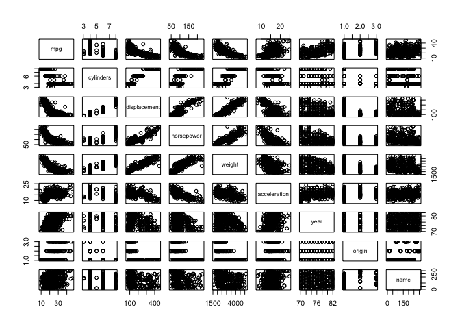
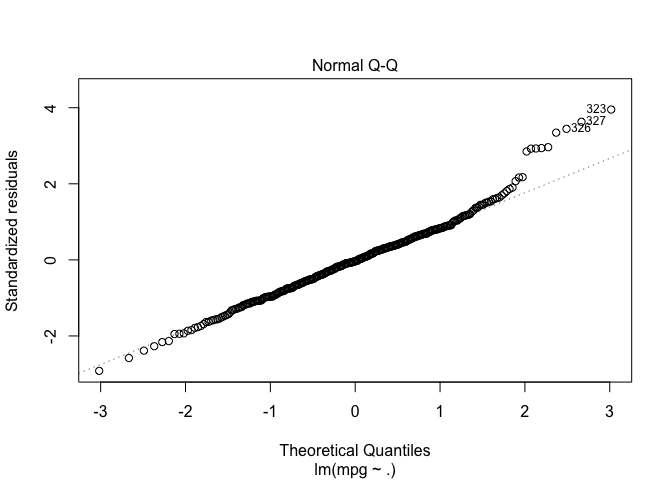

linear regression
================
MPM

``` r
library(MASS)
library(ISLR)

names(Boston)
```

    ##  [1] "crim"    "zn"      "indus"   "chas"    "nox"     "rm"      "age"    
    ##  [8] "dis"     "rad"     "tax"     "ptratio" "black"   "lstat"   "medv"

``` r
# plot some data - regress median housing value onto crime rates. 
plot(Boston$medv ~Boston$crim)
```

<!-- -->

What is the relationship between these variables - fit a linear model

``` r
fit1 = lm(Boston$medv ~Boston$crim)
fit1
```

    ## 
    ## Call:
    ## lm(formula = Boston$medv ~ Boston$crim)
    ## 
    ## Coefficients:
    ## (Intercept)  Boston$crim  
    ##     24.0331      -0.4152

``` r
plot(fit1)
```

<!-- --><!-- --><!-- --><!-- -->

print out the confidence interval for the fit of crime vs median housing
values

``` r
confint(fit1)
```

    ##                  2.5 %     97.5 %
    ## (Intercept) 23.2292723 24.8369400
    ## Boston$crim -0.5014209 -0.3289596

``` r
### Multiple linear regression
fit2=lm(medv~lstat+age,data=Boston)
summary(fit2)
```

    ## 
    ## Call:
    ## lm(formula = medv ~ lstat + age, data = Boston)
    ## 
    ## Residuals:
    ##     Min      1Q  Median      3Q     Max 
    ## -15.981  -3.978  -1.283   1.968  23.158 
    ## 
    ## Coefficients:
    ##             Estimate Std. Error t value Pr(>|t|)    
    ## (Intercept) 33.22276    0.73085  45.458  < 2e-16 ***
    ## lstat       -1.03207    0.04819 -21.416  < 2e-16 ***
    ## age          0.03454    0.01223   2.826  0.00491 ** 
    ## ---
    ## Signif. codes:  0 '***' 0.001 '**' 0.01 '*' 0.05 '.' 0.1 ' ' 1
    ## 
    ## Residual standard error: 6.173 on 503 degrees of freedom
    ## Multiple R-squared:  0.5513, Adjusted R-squared:  0.5495 
    ## F-statistic:   309 on 2 and 503 DF,  p-value: < 2.2e-16

Now fit a linear model with all of the variables included: in this model
we see hat age is no longer significant. Many other predictors are
correlated with age and when age is included with all of these other
vaiavbles it is no longer significant.

``` r
fit3=lm(medv~.,Boston)
summary(fit3)
```

    ## 
    ## Call:
    ## lm(formula = medv ~ ., data = Boston)
    ## 
    ## Residuals:
    ##     Min      1Q  Median      3Q     Max 
    ## -15.595  -2.730  -0.518   1.777  26.199 
    ## 
    ## Coefficients:
    ##               Estimate Std. Error t value Pr(>|t|)    
    ## (Intercept)  3.646e+01  5.103e+00   7.144 3.28e-12 ***
    ## crim        -1.080e-01  3.286e-02  -3.287 0.001087 ** 
    ## zn           4.642e-02  1.373e-02   3.382 0.000778 ***
    ## indus        2.056e-02  6.150e-02   0.334 0.738288    
    ## chas         2.687e+00  8.616e-01   3.118 0.001925 ** 
    ## nox         -1.777e+01  3.820e+00  -4.651 4.25e-06 ***
    ## rm           3.810e+00  4.179e-01   9.116  < 2e-16 ***
    ## age          6.922e-04  1.321e-02   0.052 0.958229    
    ## dis         -1.476e+00  1.995e-01  -7.398 6.01e-13 ***
    ## rad          3.060e-01  6.635e-02   4.613 5.07e-06 ***
    ## tax         -1.233e-02  3.760e-03  -3.280 0.001112 ** 
    ## ptratio     -9.527e-01  1.308e-01  -7.283 1.31e-12 ***
    ## black        9.312e-03  2.686e-03   3.467 0.000573 ***
    ## lstat       -5.248e-01  5.072e-02 -10.347  < 2e-16 ***
    ## ---
    ## Signif. codes:  0 '***' 0.001 '**' 0.01 '*' 0.05 '.' 0.1 ' ' 1
    ## 
    ## Residual standard error: 4.745 on 492 degrees of freedom
    ## Multiple R-squared:  0.7406, Adjusted R-squared:  0.7338 
    ## F-statistic: 108.1 on 13 and 492 DF,  p-value: < 2.2e-16

``` r
par(mfrow=c(2,2))
plot(fit3)
```

<!-- -->

The sqrt standardized residuals vs fitted plot tells you if the variance
is changing as a function of the mean….

Ok now remove some variables from the linear model

``` r
fit4 = update(fit3, ~ -age -indus)
fit4
```

    ## 
    ## Call:
    ## lm(formula = medv ~ 1, data = Boston)
    ## 
    ## Coefficients:
    ## (Intercept)  
    ##       22.53

Now want to add interaction terms the \* in the firmula means we will
have the main effect of each and the interction term.

The interaction term is represented in the summary as lstat:age.

below we see that the main effect for age is not significant the
interaction is significant.

``` r
fit5=lm(medv~lstat*age,Boston)
summary(fit5)
```

    ## 
    ## Call:
    ## lm(formula = medv ~ lstat * age, data = Boston)
    ## 
    ## Residuals:
    ##     Min      1Q  Median      3Q     Max 
    ## -15.806  -4.045  -1.333   2.085  27.552 
    ## 
    ## Coefficients:
    ##               Estimate Std. Error t value Pr(>|t|)    
    ## (Intercept) 36.0885359  1.4698355  24.553  < 2e-16 ***
    ## lstat       -1.3921168  0.1674555  -8.313 8.78e-16 ***
    ## age         -0.0007209  0.0198792  -0.036   0.9711    
    ## lstat:age    0.0041560  0.0018518   2.244   0.0252 *  
    ## ---
    ## Signif. codes:  0 '***' 0.001 '**' 0.01 '*' 0.05 '.' 0.1 ' ' 1
    ## 
    ## Residual standard error: 6.149 on 502 degrees of freedom
    ## Multiple R-squared:  0.5557, Adjusted R-squared:  0.5531 
    ## F-statistic: 209.3 on 3 and 502 DF,  p-value: < 2.2e-16

Notice here we can use the semicolon to do 2 commands…

we are adding a nonlinear relationship to the model and fitting a
polynomial function to the lstat 2 data

the I(x,y) notation means we are using the product of lstat^2 as a
predictor in the model.

``` r
fit6=lm(medv~lstat +I(lstat^2),Boston); summary(fit6)
```

    ## 
    ## Call:
    ## lm(formula = medv ~ lstat + I(lstat^2), data = Boston)
    ## 
    ## Residuals:
    ##      Min       1Q   Median       3Q      Max 
    ## -15.2834  -3.8313  -0.5295   2.3095  25.4148 
    ## 
    ## Coefficients:
    ##              Estimate Std. Error t value Pr(>|t|)    
    ## (Intercept) 42.862007   0.872084   49.15   <2e-16 ***
    ## lstat       -2.332821   0.123803  -18.84   <2e-16 ***
    ## I(lstat^2)   0.043547   0.003745   11.63   <2e-16 ***
    ## ---
    ## Signif. codes:  0 '***' 0.001 '**' 0.01 '*' 0.05 '.' 0.1 ' ' 1
    ## 
    ## Residual standard error: 5.524 on 503 degrees of freedom
    ## Multiple R-squared:  0.6407, Adjusted R-squared:  0.6393 
    ## F-statistic: 448.5 on 2 and 503 DF,  p-value: < 2.2e-16

Attatch the dataset to make the named variables (columnnames) available
for plotting without secifying Boston$ operator.

For the parmfrow thing to work to plot multipe things and for rmarkdown
documents to plot stuff you have to run the whole chunk or highlight the
portion of the code that is part of the plotting scheme (this will also
enable me to do some ggplot side by side.

``` r
attach(Boston)

par(mfrow=c(1,1))
plot(medv~lstat)

#firstargument is lstat variable, second argumant is the fitted points from the quadratic fit, fit6. 
points(lstat,fitted(fit6),col="red",pch=20)
```

<!-- -->

plotting base R: pch = the plotting character. cex = 2 means we want to
enlarge those characters by 2.

``` r
plot(1:20, pch=1:20, cex = 2)
```

<!-- -->

Now we want to work with some qualitative data.

``` r
summary(Carseats)
```

    ##      Sales          CompPrice       Income        Advertising    
    ##  Min.   : 0.000   Min.   : 77   Min.   : 21.00   Min.   : 0.000  
    ##  1st Qu.: 5.390   1st Qu.:115   1st Qu.: 42.75   1st Qu.: 0.000  
    ##  Median : 7.490   Median :125   Median : 69.00   Median : 5.000  
    ##  Mean   : 7.496   Mean   :125   Mean   : 68.66   Mean   : 6.635  
    ##  3rd Qu.: 9.320   3rd Qu.:135   3rd Qu.: 91.00   3rd Qu.:12.000  
    ##  Max.   :16.270   Max.   :175   Max.   :120.00   Max.   :29.000  
    ##    Population        Price        ShelveLoc        Age       
    ##  Min.   : 10.0   Min.   : 24.0   Bad   : 96   Min.   :25.00  
    ##  1st Qu.:139.0   1st Qu.:100.0   Good  : 85   1st Qu.:39.75  
    ##  Median :272.0   Median :117.0   Medium:219   Median :54.50  
    ##  Mean   :264.8   Mean   :115.8                Mean   :53.32  
    ##  3rd Qu.:398.5   3rd Qu.:131.0                3rd Qu.:66.00  
    ##  Max.   :509.0   Max.   :191.0                Max.   :80.00  
    ##    Education    Urban       US     
    ##  Min.   :10.0   No :118   No :142  
    ##  1st Qu.:12.0   Yes:282   Yes:258  
    ##  Median :14.0                      
    ##  Mean   :13.9                      
    ##  3rd Qu.:16.0                      
    ##  Max.   :18.0

find out how the quantitative values are coded

``` r
contrasts(Carseats$ShelveLoc)
```

    ##        Good Medium
    ## Bad       0      0
    ## Good      1      0
    ## Medium    0      1

``` r
attach(Carseats)
plot(Sales ~ ShelveLoc)
```

<!-- -->

Fit a model with interactions between income and advertising and age and
price

``` r
carmodel=lm(Sales~.+Income:Advertising+Age:Price,Carseats)
summary(carmodel)
```

    ## 
    ## Call:
    ## lm(formula = Sales ~ . + Income:Advertising + Age:Price, data = Carseats)
    ## 
    ## Residuals:
    ##     Min      1Q  Median      3Q     Max 
    ## -2.9208 -0.7503  0.0177  0.6754  3.3413 
    ## 
    ## Coefficients:
    ##                      Estimate Std. Error t value Pr(>|t|)    
    ## (Intercept)         6.5755654  1.0087470   6.519 2.22e-10 ***
    ## CompPrice           0.0929371  0.0041183  22.567  < 2e-16 ***
    ## Income              0.0108940  0.0026044   4.183 3.57e-05 ***
    ## Advertising         0.0702462  0.0226091   3.107 0.002030 ** 
    ## Population          0.0001592  0.0003679   0.433 0.665330    
    ## Price              -0.1008064  0.0074399 -13.549  < 2e-16 ***
    ## ShelveLocGood       4.8486762  0.1528378  31.724  < 2e-16 ***
    ## ShelveLocMedium     1.9532620  0.1257682  15.531  < 2e-16 ***
    ## Age                -0.0579466  0.0159506  -3.633 0.000318 ***
    ## Education          -0.0208525  0.0196131  -1.063 0.288361    
    ## UrbanYes            0.1401597  0.1124019   1.247 0.213171    
    ## USYes              -0.1575571  0.1489234  -1.058 0.290729    
    ## Income:Advertising  0.0007510  0.0002784   2.698 0.007290 ** 
    ## Price:Age           0.0001068  0.0001333   0.801 0.423812    
    ## ---
    ## Signif. codes:  0 '***' 0.001 '**' 0.01 '*' 0.05 '.' 0.1 ' ' 1
    ## 
    ## Residual standard error: 1.011 on 386 degrees of freedom
    ## Multiple R-squared:  0.8761, Adjusted R-squared:  0.8719 
    ## F-statistic:   210 on 13 and 386 DF,  p-value: < 2.2e-16

Write a little function \*\* Note that pch=20 is a nice little character
for plotting many points.

``` r
attach(Carseats)
```

    ## The following objects are masked from Carseats (pos = 3):
    ## 
    ##     Advertising, Age, CompPrice, Education, Income, Population,
    ##     Price, Sales, ShelveLoc, Urban, US

``` r
regplot=function(x,y,...){
  fit=lm(y~x)
  plot(x,y,...)
  abline(fit,col="red")
}
regplot(Price,Sales,xlab="Price",ylab="Sales",col="blue",pch=20)
```

<!-- -->

Exercises

The R^2 is the correlation between the two variables and measures how
closely they are associated. The p value and t statistic merely measure
how strong is the evidence that there is a nonzero association. Even a
weak effect can be extremely significant given enough data. Pval and t
statistic in isolation tell you nothing. R2 tells you there is a fairly
large association between x andy → it is the proportion of variance in y
explained by x.

``` r
names(Auto)
```

    ## [1] "mpg"          "cylinders"    "displacement" "horsepower"  
    ## [5] "weight"       "acceleration" "year"         "origin"      
    ## [9] "name"

``` r
attach(Auto)
```

quick plot of all variables with pairs()

``` r
pairs(Auto)
```

<!-- -->

weight horsepower displacement look negatively coorelated with mpg.

``` r
library(ggplot2)
```

    ## 
    ## Attaching package: 'ggplot2'

    ## The following object is masked from 'Auto':
    ## 
    ##     mpg

``` r
ggplot(data = Auto)+ 
  aes(x=horsepower, y=mpg, color = weight) + 
  geom_point() + 
  theme_light()
```

<!-- -->

there is a noticable relationship between horsepower and mpg, with the
weight of the car also tracking with the horsepower. WE could probably
recode weight as a categorical and bin in 2 or three groups for a
logistic fit.

``` r
ggplot(data = Auto)+ 
  aes(x=horsepower, y=mpg, color = year ) + 
  geom_point() + 
  geom_smooth(method = "lm") + 
  theme_light()
```

<!-- -->

now build a model

``` r
auto1 <- lm(Auto$mpg~Auto$horsepower)

summary(auto1)
```

    ## 
    ## Call:
    ## lm(formula = Auto$mpg ~ Auto$horsepower)
    ## 
    ## Residuals:
    ##      Min       1Q   Median       3Q      Max 
    ## -13.5710  -3.2592  -0.3435   2.7630  16.9240 
    ## 
    ## Coefficients:
    ##                  Estimate Std. Error t value Pr(>|t|)    
    ## (Intercept)     39.935861   0.717499   55.66   <2e-16 ***
    ## Auto$horsepower -0.157845   0.006446  -24.49   <2e-16 ***
    ## ---
    ## Signif. codes:  0 '***' 0.001 '**' 0.01 '*' 0.05 '.' 0.1 ' ' 1
    ## 
    ## Residual standard error: 4.906 on 390 degrees of freedom
    ## Multiple R-squared:  0.6059, Adjusted R-squared:  0.6049 
    ## F-statistic: 599.7 on 1 and 390 DF,  p-value: < 2.2e-16

For every 10 increase in horsepower our miles per gallon drops by about
1.5 in the model but it also appears that we can fit a polynomial
coefficient as well.

predict the mpg of a car w 98 hp

``` r
predict(auto1, data.frame(horsepower=c(98)), interval="prediction")
```

    ## Warning: 'newdata' had 1 row but variables found have 392 rows

    ##           fit        lwr      upr
    ## 1   19.416046  9.7532948 29.07880
    ## 2   13.891480  4.2037318 23.57923
    ## 3   16.259151  6.5845976 25.93370
    ## 4   16.259151  6.5845976 25.93370
    ## 5   17.837598  8.1697749 27.50542
    ## 6    8.682604 -1.0471901 18.41240
    ## 7    5.210020 -4.5576558 14.97770
    ## 8    5.999243 -3.7591362 15.75762
    ## 9    4.420796 -5.3565771 14.19817
    ## 10   9.945362  0.2273963 19.66333
    ## 11  13.102256  3.4092855 22.79523
    ## 12  14.680704  4.9977664 24.36364
    ## 13  16.259151  6.5845976 25.93370
    ## 14   4.420796 -5.3565771 14.19817
    ## 15  24.940611 15.2825327 34.59869
    ## 16  24.940611 15.2825327 34.59869
    ## 17  24.624922 14.9671249 34.28272
    ## 18  26.519059 16.8585745 36.17954
    ## 19  26.045524 16.3859365 35.70511
    ## 20  32.675003 22.9892883 42.36072
    ## 21  26.203369 16.5434991 35.86324
    ## 22  25.729835 16.0707614 35.38891
    ## 23  24.940611 15.2825327 34.59869
    ## 24  22.099406 12.4414680 31.75734
    ## 25  25.729835 16.0707614 35.38891
    ## 26   5.999243 -3.7591362 15.75762
    ## 27   8.366914 -1.3659995 18.09983
    ## 28   6.788467 -2.9610196 16.53795
    ## 29   9.471827 -0.2504514 19.19411
    ## 30  26.045524 16.3859365 35.70511
    ## 31  25.729835 16.0707614 35.38891
    ## 32  24.940611 15.2825327 34.59869
    ## 33  24.151388 14.4938885 33.80889
    ## 34  23.362164 13.7048286 33.01950
    ## 35  24.151388 14.4938885 33.80889
    ## 36  26.045524 16.3859365 35.70511
    ## 37  24.151388 14.4938885 33.80889
    ## 38  13.891480  4.2037318 23.57923
    ## 39  12.313033  2.6144281 22.01164
    ## 40  15.785617  6.1087217 25.46251
    ## 41  16.259151  6.5845976 25.93370
    ## 42  11.523809  1.8191602 21.22846
    ## 43  13.102256  3.4092855 22.79523
    ## 44  12.313033  2.6144281 22.01164
    ## 45  22.572940 12.9153529 32.23053
    ## 46  28.571040 18.9049457 38.23713
    ## 47  24.151388 14.4938885 33.80889
    ## 48  26.045524 16.3859365 35.70511
    ## 49  26.361214 16.7010451 36.02138
    ## 50  25.729835 16.0707614 35.38891
    ## 51  28.886730 19.2195232 38.55394
    ## 52  27.939661 18.2755918 37.60373
    ## 53  29.675953 20.0056767 39.34623
    ## 54  29.044574 19.3767870 38.71236
    ## 55  30.465177 20.7914163 40.13894
    ## 56  28.886730 19.2195232 38.55394
    ## 57  24.940611 15.2825327 34.59869
    ## 58  27.308282 17.6459724 36.97059
    ## 59  31.412245 21.7337578 41.09073
    ## 60  25.729835 16.0707614 35.38891
    ## 61  26.361214 16.7010451 36.02138
    ## 62  13.891480  4.2037318 23.57923
    ## 63  12.313033  2.6144281 22.01164
    ## 64  16.259151  6.5845976 25.93370
    ## 65  15.785617  6.1087217 25.46251
    ## 66  16.259151  6.5845976 25.93370
    ## 67   7.104156 -2.6418860 16.85020
    ## 68  15.469927  5.7913884 25.14847
    ## 69  14.680704  4.9977664 24.36364
    ## 70   9.945362  0.2273963 19.66333
    ## 71  24.624922 14.9671249 34.28272
    ## 72  16.259151  6.5845976 25.93370
    ## 73  19.416046  9.7532948 29.07880
    ## 74  17.837598  8.1697749 27.50542
    ## 75  16.259151  6.5845976 25.93370
    ## 76  22.257251 12.5994463 31.91506
    ## 77  27.939661 18.2755918 37.60373
    ## 78  26.203369 16.5434991 35.86324
    ## 79  29.044574 19.3767870 38.71236
    ## 80  26.361214 16.7010451 36.02138
    ## 81  25.414146 15.7555198 35.07277
    ## 82  24.624922 14.9671249 34.28272
    ## 83  27.308282 17.6459724 36.97059
    ## 84  26.045524 16.3859365 35.70511
    ## 85  12.313033  2.6144281 22.01164
    ## 86  16.259151  6.5845976 25.93370
    ## 87  17.048375  7.3773932 26.71936
    ## 88  18.311133  8.6450050 27.97726
    ## 89  16.259151  6.5845976 25.93370
    ## 90   8.682604 -1.0471901 18.41240
    ## 91  16.259151  6.5845976 25.93370
    ## 92  14.996393  5.3152647 24.67752
    ## 93  16.259151  6.5845976 25.93370
    ## 94   5.999243 -3.7591362 15.75762
    ## 95   4.420796 -5.3565771 14.19817
    ## 96  12.313033  2.6144281 22.01164
    ## 97  23.362164 13.7048286 33.01950
    ## 98  24.151388 14.4938885 33.80889
    ## 99  24.151388 14.4938885 33.80889
    ## 100 26.045524 16.3859365 35.70511
    ## 101 24.940611 15.2825327 34.59869
    ## 102 32.675003 22.9892883 42.36072
    ## 103 16.259151  6.5845976 25.93370
    ## 104 13.575791  3.8860027 23.26558
    ## 105 13.102256  3.4092855 22.79523
    ## 106 11.523809  1.8191602 21.22846
    ## 107 24.151388 14.4938885 33.80889
    ## 108 26.045524 16.3859365 35.70511
    ## 109 28.571040 18.9049457 38.23713
    ## 110 25.098456 15.4402117 34.75670
    ## 111 25.729835 16.0707614 35.38891
    ## 112 26.519059 16.8585745 36.17954
    ## 113 23.046475 13.3890882 32.70386
    ## 114 25.729835 16.0707614 35.38891
    ## 115 17.048375  7.3773932 26.71936
    ## 116  3.631572 -6.1558990 13.41904
    ## 117 32.201469 22.5185881 41.88435
    ## 118 28.097506 18.4329552 37.76206
    ## 119 25.571990 15.9131489 35.23083
    ## 120 22.257251 12.5994463 31.91506
    ## 121 16.259151  6.5845976 25.93370
    ## 122 22.572940 12.9153529 32.23053
    ## 123 20.678804 11.0189156 30.33869
    ## 124 11.523809  1.8191602 21.22846
    ## 125 24.940611 15.2825327 34.59869
    ## 126 24.151388 14.4938885 33.80889
    ## 127 24.151388 14.4938885 33.80889
    ## 128 29.360264 19.6912650 39.02926
    ## 129 27.308282 17.6459724 36.97059
    ## 130 29.675953 20.0056767 39.34623
    ## 131 28.097506 18.4329552 37.76206
    ## 132 24.151388 14.4938885 33.80889
    ## 133 22.572940 12.9153529 32.23053
    ## 134 23.362164 13.7048286 33.01950
    ## 135 17.837598  8.1697749 27.50542
    ## 136 16.259151  6.5845976 25.93370
    ## 137 16.259151  6.5845976 25.93370
    ## 138 17.837598  8.1697749 27.50542
    ## 139 16.259151  6.5845976 25.93370
    ## 140 26.834748 17.1735835 36.49591
    ## 141 29.360264 19.6912650 39.02926
    ## 142 27.623972 17.9608153 37.28713
    ## 143 31.727935 22.0477395 41.40813
    ## 144 30.307332 20.6343015 39.98036
    ## 145 28.097506 18.4329552 37.76206
    ## 146 28.097506 18.4329552 37.76206
    ## 147 28.097506 18.4329552 37.76206
    ## 148 24.624922 14.9671249 34.28272
    ## 149 25.256301 15.5978741 34.91473
    ## 150 29.360264 19.6912650 39.02926
    ## 151 24.940611 15.2825327 34.59869
    ## 152 23.362164 13.7048286 33.01950
    ## 153 28.571040 18.9049457 38.23713
    ## 154 28.571040 18.9049457 38.23713
    ## 155 13.102256  3.4092855 22.79523
    ## 156 17.048375  7.3773932 26.71936
    ## 157 16.259151  6.5845976 25.93370
    ## 158 16.574840  6.9017655 26.24792
    ## 159 22.572940 12.9153529 32.23053
    ## 160 23.362164 13.7048286 33.01950
    ## 161 22.572940 12.9153529 32.23053
    ## 162 24.940611 15.2825327 34.59869
    ## 163 22.572940 12.9153529 32.23053
    ## 164 22.572940 12.9153529 32.23053
    ## 165 19.573890  9.9115555 29.23623
    ## 166 28.097506 18.4329552 37.76206
    ## 167 26.834748 17.1735835 36.49591
    ## 168 24.151388 14.4938885 33.80889
    ## 169 27.623972 17.9608153 37.28713
    ## 170 24.782767 15.1248371 34.44070
    ## 171 28.728885 19.0622427 38.39553
    ## 172 24.624922 14.9671249 34.28272
    ## 173 24.624922 14.9671249 34.28272
    ## 174 28.886730 19.2195232 38.55394
    ## 175 25.729835 16.0707614 35.38891
    ## 176 24.940611 15.2825327 34.59869
    ## 177 26.045524 16.3859365 35.70511
    ## 178 24.467077 14.8093961 34.12476
    ## 179 21.783717 12.1254616 31.44197
    ## 180 31.570090 21.8907569 41.24942
    ## 181 26.361214 16.7010451 36.02138
    ## 182 27.150438 17.4885260 36.81235
    ## 183 25.414146 15.7555198 35.07277
    ## 184 27.466127 17.8034021 37.12885
    ## 185 26.834748 17.1735835 36.49591
    ## 186 17.837598  8.1697749 27.50542
    ## 187 16.259151  6.5845976 25.93370
    ## 188 20.994493 11.3351547 30.65383
    ## 189 15.943462  6.2673635 25.61956
    ## 190 24.151388 14.4938885 33.80889
    ## 191 23.362164 13.7048286 33.01950
    ## 192 27.150438 17.4885260 36.81235
    ## 193 25.729835 16.0707614 35.38891
    ## 194 31.727935 22.0477395 41.40813
    ## 195 30.465177 20.7914163 40.13894
    ## 196 28.886730 19.2195232 38.55394
    ## 197 31.570090 21.8907569 41.24942
    ## 198 24.151388 14.4938885 33.80889
    ## 199 27.623972 17.9608153 37.28713
    ## 200 22.572940 12.9153529 32.23053
    ## 201 24.940611 15.2825327 34.59869
    ## 202 28.728885 19.0622427 38.39553
    ## 203 28.886730 19.2195232 38.55394
    ## 204 28.097506 18.4329552 37.76206
    ## 205 28.571040 18.9049457 38.23713
    ## 206 23.835698 14.1783144 33.49308
    ## 207 16.259151  6.5845976 25.93370
    ## 208 26.045524 16.3859365 35.70511
    ## 209 22.888630 13.2311931 32.54607
    ## 210 20.994493 11.3351547 30.65383
    ## 211 11.523809  1.8191602 21.22846
    ## 212 17.048375  7.3773932 26.71936
    ## 213 19.416046  9.7532948 29.07880
    ## 214 16.259151  6.5845976 25.93370
    ## 215 29.202419 19.5340343 38.87080
    ## 216 27.308282 17.6459724 36.97059
    ## 217 30.780866 21.1055963 40.45614
    ## 218 24.782767 15.1248371 34.44070
    ## 219 28.886730 19.2195232 38.55394
    ## 220 17.048375  7.3773932 26.71936
    ## 221 22.572940 12.9153529 32.23053
    ## 222 17.048375  7.3773932 26.71936
    ## 223 19.416046  9.7532948 29.07880
    ## 224 22.572940 12.9153529 32.23053
    ## 225 23.362164 13.7048286 33.01950
    ## 226 24.151388 14.4938885 33.80889
    ## 227 24.467077 14.8093961 34.12476
    ## 228 11.523809  1.8191602 21.22846
    ## 229 13.102256  3.4092855 22.79523
    ## 230  9.945362  0.2273963 19.66333
    ## 231 16.416996  6.7431898 26.09080
    ## 232 27.623972 17.9608153 37.28713
    ## 233 26.045524 16.3859365 35.70511
    ## 234 28.097506 18.4329552 37.76206
    ## 235 25.887680 16.2283572 35.54700
    ## 236 29.991643 20.3200222 39.66326
    ## 237 26.834748 17.1735835 36.49591
    ## 238 29.360264 19.6912650 39.02926
    ## 239 27.623972 17.9608153 37.28713
    ## 240 24.624922 14.9671249 34.28272
    ## 241 22.572940 12.9153529 32.23053
    ## 242 22.572940 12.9153529 32.23053
    ## 243 32.359314 22.6755047 42.04312
    ## 244 29.518109 19.8484792 39.18774
    ## 245 31.727935 22.0477395 41.40813
    ## 246 28.886730 19.2195232 38.55394
    ## 247 30.465177 20.7914163 40.13894
    ## 248 22.572940 12.9153529 32.23053
    ## 249 17.837598  8.1697749 27.50542
    ## 250 17.995443  8.3282015 27.66268
    ## 251 23.362164 13.7048286 33.01950
    ## 252 24.940611 15.2825327 34.59869
    ## 253 26.519059 16.8585745 36.17954
    ## 254 26.045524 16.3859365 35.70511
    ## 255 24.151388 14.4938885 33.80889
    ## 256 25.729835 16.0707614 35.38891
    ## 257 23.362164 13.7048286 33.01950
    ## 258 26.519059 16.8585745 36.17954
    ## 259 22.572940 12.9153529 32.23053
    ## 260 20.994493 11.3351547 30.65383
    ## 261 17.048375  7.3773932 26.71936
    ## 262 13.891480  4.2037318 23.57923
    ## 263 17.995443  8.3282015 27.66268
    ## 264 17.837598  8.1697749 27.50542
    ## 265 29.202419 19.5340343 38.87080
    ## 266 24.940611 15.2825327 34.59869
    ## 267 24.624922 14.9671249 34.28272
    ## 268 28.097506 18.4329552 37.76206
    ## 269 24.940611 15.2825327 34.59869
    ## 270 23.362164 13.7048286 33.01950
    ## 271 26.519059 16.8585745 36.17954
    ## 272 24.624922 14.9671249 34.28272
    ## 273 23.677853 14.0205024 33.33520
    ## 274 20.205269 10.5444324 29.86611
    ## 275 21.783717 12.1254616 31.44197
    ## 276 18.942511  9.2784130 28.60661
    ## 277 28.728885 19.0622427 38.39553
    ## 278 29.202419 19.5340343 38.87080
    ## 279 21.783717 12.1254616 31.44197
    ## 280 26.519059 16.8585745 36.17954
    ## 281 26.045524 16.3859365 35.70511
    ## 282 25.729835 16.0707614 35.38891
    ## 283 22.572940 12.9153529 32.23053
    ## 284 19.416046  9.7532948 29.07880
    ## 285 19.573890  9.9115555 29.23623
    ## 286 18.153288  8.4866115 27.81996
    ## 287 18.626822  8.9617422 28.29190
    ## 288 15.469927  5.7913884 25.14847
    ## 289 17.521909  7.8528719 27.19095
    ## 290 20.205269 10.5444324 29.86611
    ## 291 16.259151  6.5845976 25.93370
    ## 292 28.728885 19.0622427 38.39553
    ## 293 29.675953 20.0056767 39.34623
    ## 294 27.308282 17.6459724 36.97059
    ## 295 27.308282 17.6459724 36.97059
    ## 296 27.781817 18.1182118 37.44542
    ## 297 20.205269 10.5444324 29.86611
    ## 298 28.728885 19.0622427 38.39553
    ## 299 25.729835 16.0707614 35.38891
    ## 300 28.886730 19.2195232 38.55394
    ## 301 28.886730 19.2195232 38.55394
    ## 302 29.675953 20.0056767 39.34623
    ## 303 29.044574 19.3767870 38.71236
    ## 304 25.729835 16.0707614 35.38891
    ## 305 21.783717 12.1254616 31.44197
    ## 306 21.783717 12.1254616 31.44197
    ## 307 25.729835 16.0707614 35.38891
    ## 308 27.939661 18.2755918 37.60373
    ## 309 30.465177 20.7914163 40.13894
    ## 310 28.886730 19.2195232 38.55394
    ## 311 29.675953 20.0056767 39.34623
    ## 312 25.729835 16.0707614 35.38891
    ## 313 26.045524 16.3859365 35.70511
    ## 314 25.729835 16.0707614 35.38891
    ## 315 25.729835 16.0707614 35.38891
    ## 316 27.623972 17.9608153 37.28713
    ## 317 25.729835 16.0707614 35.38891
    ## 318 28.097506 18.4329552 37.76206
    ## 319 25.414146 15.7555198 35.07277
    ## 320 28.097506 18.4329552 37.76206
    ## 321 29.675953 20.0056767 39.34623
    ## 322 23.362164 13.7048286 33.01950
    ## 323 29.675953 20.0056767 39.34623
    ## 324 32.359314 22.6755047 42.04312
    ## 325 32.359314 22.6755047 42.04312
    ## 326 29.360264 19.6912650 39.02926
    ## 327 29.360264 19.6912650 39.02926
    ## 328 29.360264 19.6912650 39.02926
    ## 329 29.360264 19.6912650 39.02926
    ## 330 30.149488 20.4771701 39.82180
    ## 331 19.100356  9.4367235 28.76399
    ## 332 24.151388 14.4938885 33.80889
    ## 333 26.045524 16.3859365 35.70511
    ## 334 28.571040 18.9049457 38.23713
    ## 335 26.676903 17.0160873 36.33772
    ## 336 26.676903 17.0160873 36.33772
    ## 337 25.414146 15.7555198 35.07277
    ## 338 22.572940 12.9153529 32.23053
    ## 339 26.676903 17.0160873 36.33772
    ## 340 30.780866 21.1055963 40.45614
    ## 341 29.833798 20.1628578 39.50474
    ## 342 30.465177 20.7914163 40.13894
    ## 343 29.360264 19.6912650 39.02926
    ## 344 29.675953 20.0056767 39.34623
    ## 345 30.149488 20.4771701 39.82180
    ## 346 29.202419 19.5340343 38.87080
    ## 347 29.991643 20.3200222 39.66326
    ## 348 29.675953 20.0056767 39.34623
    ## 349 29.675953 20.0056767 39.34623
    ## 350 28.255351 18.5903019 37.92040
    ## 351 28.097506 18.4329552 37.76206
    ## 352 28.097506 18.4329552 37.76206
    ## 353 24.151388 14.4938885 33.80889
    ## 354 28.255351 18.5903019 37.92040
    ## 355 27.308282 17.6459724 36.97059
    ## 356 27.939661 18.2755918 37.60373
    ## 357 21.625872 11.9674335 31.28431
    ## 358 20.994493 11.3351547 30.65383
    ## 359 22.572940 12.9153529 32.23053
    ## 360 23.362164 13.7048286 33.01950
    ## 361 26.045524 16.3859365 35.70511
    ## 362 26.519059 16.8585745 36.17954
    ## 363 26.045524 16.3859365 35.70511
    ## 364 26.045524 16.3859365 35.70511
    ## 365 26.045524 16.3859365 35.70511
    ## 366 26.519059 16.8585745 36.17954
    ## 367 26.676903 17.0160873 36.33772
    ## 368 25.729835 16.0707614 35.38891
    ## 369 25.414146 15.7555198 35.07277
    ## 370 28.255351 18.5903019 37.92040
    ## 371 29.202419 19.5340343 38.87080
    ## 372 29.202419 19.5340343 38.87080
    ## 373 29.991643 20.3200222 39.66326
    ## 374 28.886730 19.2195232 38.55394
    ## 375 26.045524 16.3859365 35.70511
    ## 376 28.097506 18.4329552 37.76206
    ## 377 28.886730 19.2195232 38.55394
    ## 378 29.360264 19.6912650 39.02926
    ## 379 29.360264 19.6912650 39.02926
    ## 380 29.360264 19.6912650 39.02926
    ## 381 22.572940 12.9153529 32.23053
    ## 382 26.519059 16.8585745 36.17954
    ## 383 25.414146 15.7555198 35.07277
    ## 384 22.257251 12.5994463 31.91506
    ## 385 24.782767 15.1248371 34.44070
    ## 386 26.676903 17.0160873 36.33772
    ## 387 25.729835 16.0707614 35.38891
    ## 388 26.361214 16.7010451 36.02138
    ## 389 31.727935 22.0477395 41.40813
    ## 390 26.676903 17.0160873 36.33772
    ## 391 27.466127 17.8034021 37.12885
    ## 392 26.992593 17.3310631 36.65412

Quick and easy way to display some key regression features in ggplot
found here:
<https://sejohnston.com/2012/08/09/a-quick-and-easy-function-to-plot-lm-results-in-r/>
slighylt modified

``` r
ggplotRegression <- function (fit) {

    require(ggplot2)
    ggplot(fit$model, aes_string(x = names(fit$model)[2], y = names(fit$model)[1])) + 
      geom_point() +
      theme_light() +
      stat_smooth(method = "lm", col = "blue") +
      labs(title = paste("Adj R2 = ",signif(summary(fit)$adj.r.squared, 5),
                         "Intercept =",signif(fit$coef[[1]],5 ),
                         " Slope =",signif(fit$coef[[2]], 5),
                         " P =",signif(summary(fit)$coef[2,4], 5)))
}

ggplotRegression(auto1)
```

<!-- -->

Now look through the diagnostic plots; her eare definitely highly
leveraged observations of horsepower.

Cook’s distance is the sum of all the changes in the regression model
(the fitted response values + the MSE) when observation i is removed
from the regression
model.

``` r
plot(auto1)
```

<!-- --><!-- --><!-- --><!-- -->

``` r
library(dplyr)
```

    ## 
    ## Attaching package: 'dplyr'

    ## The following object is masked from 'package:MASS':
    ## 
    ##     select

    ## The following objects are masked from 'package:stats':
    ## 
    ##     filter, lag

    ## The following objects are masked from 'package:base':
    ## 
    ##     intersect, setdiff, setequal, union

``` r
library(corrplot)
```

    ## corrplot 0.84 loaded

``` r
attach(Auto)
```

    ## The following object is masked from package:ggplot2:
    ## 
    ##     mpg

    ## The following objects are masked from Auto (pos = 6):
    ## 
    ##     acceleration, cylinders, displacement, horsepower, mpg, name,
    ##     origin, weight, year

``` r
Auto = Auto %>% 
  select(-name)


heatmap(cor(Auto))
```

<!-- -->

``` r
cor(Auto)
```

    ##                     mpg  cylinders displacement horsepower     weight
    ## mpg           1.0000000 -0.7776175   -0.8051269 -0.7784268 -0.8322442
    ## cylinders    -0.7776175  1.0000000    0.9508233  0.8429834  0.8975273
    ## displacement -0.8051269  0.9508233    1.0000000  0.8972570  0.9329944
    ## horsepower   -0.7784268  0.8429834    0.8972570  1.0000000  0.8645377
    ## weight       -0.8322442  0.8975273    0.9329944  0.8645377  1.0000000
    ## acceleration  0.4233285 -0.5046834   -0.5438005 -0.6891955 -0.4168392
    ## year          0.5805410 -0.3456474   -0.3698552 -0.4163615 -0.3091199
    ## origin        0.5652088 -0.5689316   -0.6145351 -0.4551715 -0.5850054
    ##              acceleration       year     origin
    ## mpg             0.4233285  0.5805410  0.5652088
    ## cylinders      -0.5046834 -0.3456474 -0.5689316
    ## displacement   -0.5438005 -0.3698552 -0.6145351
    ## horsepower     -0.6891955 -0.4163615 -0.4551715
    ## weight         -0.4168392 -0.3091199 -0.5850054
    ## acceleration    1.0000000  0.2903161  0.2127458
    ## year            0.2903161  1.0000000  0.1815277
    ## origin          0.2127458  0.1815277  1.0000000

``` r
all <- lm(mpg ~ ., data = Auto)
summary(all)
```

    ## 
    ## Call:
    ## lm(formula = mpg ~ ., data = Auto)
    ## 
    ## Residuals:
    ##     Min      1Q  Median      3Q     Max 
    ## -9.5903 -2.1565 -0.1169  1.8690 13.0604 
    ## 
    ## Coefficients:
    ##                Estimate Std. Error t value Pr(>|t|)    
    ## (Intercept)  -17.218435   4.644294  -3.707  0.00024 ***
    ## cylinders     -0.493376   0.323282  -1.526  0.12780    
    ## displacement   0.019896   0.007515   2.647  0.00844 ** 
    ## horsepower    -0.016951   0.013787  -1.230  0.21963    
    ## weight        -0.006474   0.000652  -9.929  < 2e-16 ***
    ## acceleration   0.080576   0.098845   0.815  0.41548    
    ## year           0.750773   0.050973  14.729  < 2e-16 ***
    ## origin         1.426141   0.278136   5.127 4.67e-07 ***
    ## ---
    ## Signif. codes:  0 '***' 0.001 '**' 0.01 '*' 0.05 '.' 0.1 ' ' 1
    ## 
    ## Residual standard error: 3.328 on 384 degrees of freedom
    ## Multiple R-squared:  0.8215, Adjusted R-squared:  0.8182 
    ## F-statistic: 252.4 on 7 and 384 DF,  p-value: < 2.2e-16

``` r
plot(all)
```

<!-- --><!-- --><!-- --><!-- -->

Add some interaction terms – try to figure out if fuel efficiency added
each year is directly correlated with vehicle weight:

``` r
interact <- lm(mpg ~ weight*year)
summary(interact)
```

    ## 
    ## Call:
    ## lm(formula = mpg ~ weight * year)
    ## 
    ## Residuals:
    ##     Min      1Q  Median      3Q     Max 
    ## -8.0397 -1.9956 -0.0983  1.6525 12.9896 
    ## 
    ## Coefficients:
    ##               Estimate Std. Error t value Pr(>|t|)    
    ## (Intercept) -1.105e+02  1.295e+01  -8.531 3.30e-16 ***
    ## weight       2.755e-02  4.413e-03   6.242 1.14e-09 ***
    ## year         2.040e+00  1.718e-01  11.876  < 2e-16 ***
    ## weight:year -4.579e-04  5.907e-05  -7.752 8.02e-14 ***
    ## ---
    ## Signif. codes:  0 '***' 0.001 '**' 0.01 '*' 0.05 '.' 0.1 ' ' 1
    ## 
    ## Residual standard error: 3.193 on 388 degrees of freedom
    ## Multiple R-squared:  0.8339, Adjusted R-squared:  0.8326 
    ## F-statistic: 649.3 on 3 and 388 DF,  p-value: < 2.2e-16

``` r
ggplotRegression(interact)
```

<!-- -->

F-statistic: 649.3 on 3 and 388 DF, p-value: \<
2.2e-16\*

``` r
plot(interact)
```

<!-- --><!-- --><!-- --><!-- -->
