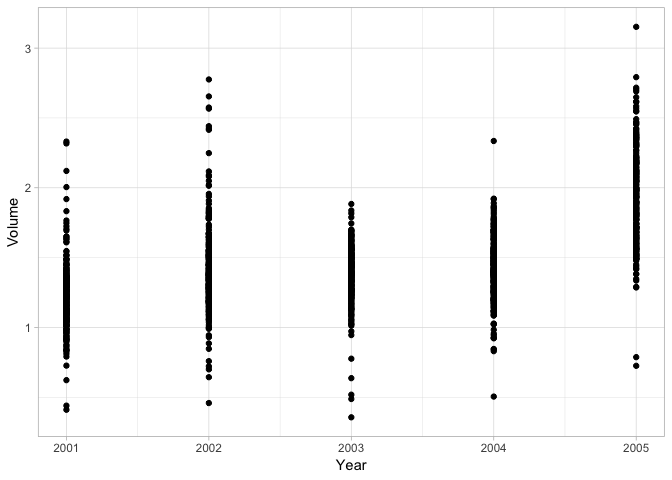
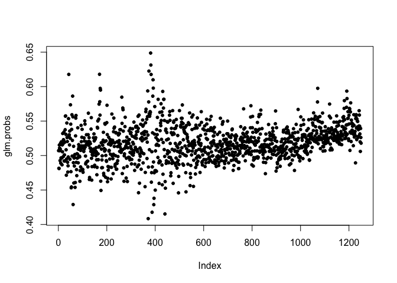

4.classification
================
mpm

returns frommkt over 1250 days - s\&p 500 percentage of growth
lag1-lag5. Lolume is total number traded today - percentage growth on
day direction - up or down, can we predict up or down?

``` r
library(ISLR)
attach(Smarket)
names(Smarket)
```

    ## [1] "Year"      "Lag1"      "Lag2"      "Lag3"      "Lag4"      "Lag5"     
    ## [7] "Volume"    "Today"     "Direction"

``` r
library(ggplot2)
summary(Smarket)
```

    ##       Year           Lag1                Lag2          
    ##  Min.   :2001   Min.   :-4.922000   Min.   :-4.922000  
    ##  1st Qu.:2002   1st Qu.:-0.639500   1st Qu.:-0.639500  
    ##  Median :2003   Median : 0.039000   Median : 0.039000  
    ##  Mean   :2003   Mean   : 0.003834   Mean   : 0.003919  
    ##  3rd Qu.:2004   3rd Qu.: 0.596750   3rd Qu.: 0.596750  
    ##  Max.   :2005   Max.   : 5.733000   Max.   : 5.733000  
    ##       Lag3                Lag4                Lag5         
    ##  Min.   :-4.922000   Min.   :-4.922000   Min.   :-4.92200  
    ##  1st Qu.:-0.640000   1st Qu.:-0.640000   1st Qu.:-0.64000  
    ##  Median : 0.038500   Median : 0.038500   Median : 0.03850  
    ##  Mean   : 0.001716   Mean   : 0.001636   Mean   : 0.00561  
    ##  3rd Qu.: 0.596750   3rd Qu.: 0.596750   3rd Qu.: 0.59700  
    ##  Max.   : 5.733000   Max.   : 5.733000   Max.   : 5.73300  
    ##      Volume           Today           Direction 
    ##  Min.   :0.3561   Min.   :-4.922000   Down:602  
    ##  1st Qu.:1.2574   1st Qu.:-0.639500   Up  :648  
    ##  Median :1.4229   Median : 0.038500             
    ##  Mean   :1.4783   Mean   : 0.003138             
    ##  3rd Qu.:1.6417   3rd Qu.: 0.596750             
    ##  Max.   :3.1525   Max.   : 5.733000

``` r
Smarket[1:5,1:4]
```

    ##   Year   Lag1   Lag2   Lag3
    ## 1 2001  0.381 -0.192 -2.624
    ## 2 2001  0.959  0.381 -0.192
    ## 3 2001  1.032  0.959  0.381
    ## 4 2001 -0.623  1.032  0.959
    ## 5 2001  0.614 -0.623  1.032

``` r
cor(Smarket[,-9])
```

    ##              Year         Lag1         Lag2         Lag3         Lag4
    ## Year   1.00000000  0.029699649  0.030596422  0.033194581  0.035688718
    ## Lag1   0.02969965  1.000000000 -0.026294328 -0.010803402 -0.002985911
    ## Lag2   0.03059642 -0.026294328  1.000000000 -0.025896670 -0.010853533
    ## Lag3   0.03319458 -0.010803402 -0.025896670  1.000000000 -0.024051036
    ## Lag4   0.03568872 -0.002985911 -0.010853533 -0.024051036  1.000000000
    ## Lag5   0.02978799 -0.005674606 -0.003557949 -0.018808338 -0.027083641
    ## Volume 0.53900647  0.040909908 -0.043383215 -0.041823686 -0.048414246
    ## Today  0.03009523 -0.026155045 -0.010250033 -0.002447647 -0.006899527
    ##                Lag5      Volume        Today
    ## Year    0.029787995  0.53900647  0.030095229
    ## Lag1   -0.005674606  0.04090991 -0.026155045
    ## Lag2   -0.003557949 -0.04338321 -0.010250033
    ## Lag3   -0.018808338 -0.04182369 -0.002447647
    ## Lag4   -0.027083641 -0.04841425 -0.006899527
    ## Lag5    1.000000000 -0.02200231 -0.034860083
    ## Volume -0.022002315  1.00000000  0.014591823
    ## Today  -0.034860083  0.01459182  1.000000000

plot volume

``` r
ggplot(data=Smarket, aes(x=Year, y=Volume))+
  geom_point()+
  theme_light()
```

<!-- -->

Now fit a logistic regression to fit Direction using lag1-lag5 and
volume.

``` r
glm.fits = glm(Direction~Lag1+Lag2+Lag3+Lag4+Lag5+Volume, data=Smarket, family=binomial)
summary(glm.fits)
```

    ## 
    ## Call:
    ## glm(formula = Direction ~ Lag1 + Lag2 + Lag3 + Lag4 + Lag5 + 
    ##     Volume, family = binomial, data = Smarket)
    ## 
    ## Deviance Residuals: 
    ##    Min      1Q  Median      3Q     Max  
    ## -1.446  -1.203   1.065   1.145   1.326  
    ## 
    ## Coefficients:
    ##              Estimate Std. Error z value Pr(>|z|)
    ## (Intercept) -0.126000   0.240736  -0.523    0.601
    ## Lag1        -0.073074   0.050167  -1.457    0.145
    ## Lag2        -0.042301   0.050086  -0.845    0.398
    ## Lag3         0.011085   0.049939   0.222    0.824
    ## Lag4         0.009359   0.049974   0.187    0.851
    ## Lag5         0.010313   0.049511   0.208    0.835
    ## Volume       0.135441   0.158360   0.855    0.392
    ## 
    ## (Dispersion parameter for binomial family taken to be 1)
    ## 
    ##     Null deviance: 1731.2  on 1249  degrees of freedom
    ## Residual deviance: 1727.6  on 1243  degrees of freedom
    ## AIC: 1741.6
    ## 
    ## Number of Fisher Scoring iterations: 3

predict function = predict probability the market will go up given the
values of the preictors in the model . remember glm is fitting a model
of “direction” as a function of the lag variables and volume of stock
traded.

``` r
glm.probs = predict(glm.fits, type="response")
plot(glm.probs, pch=20)
```

<!-- -->

``` r
# note that GLM.probs is a class numeric with length 1250.
```

To predict whenther market will go up or down convert the PREDICTED
PROBABILITIES into class labels of “up” and “down”

``` r
# first make a vector of values that say "down"
glm.pred = rep("down", 1250)

#now convert the down values int oup values for each corresponding p>50 from glm probs. 
glm.pred[glm.probs > 0.5] = "up"

# now use the table function with arguments glm pred vs direction to create a confusion matrix.

table(glm.pred, Direction)
```

    ##         Direction
    ## glm.pred Down  Up
    ##     down  145 141
    ##     up    457 507

We can use the above output to calculate sensitivity and specificity
characteristics for the predictor.

Note that these are misleading results. The model was trained and tested
on the same dataset. the percnt correct is 52 os the training error rate
is 47% which is an underestimate of the testing error rate. We need to
fit the model usoing part of the data then calculate the accuracy on
hold out or out of bag portion ofthe data.

One example is using the data from 2001 to 2004 to predic the responses
from 2005.

Subsetting with boolean logical vectors

``` r
train <- (Year<2005)

#subsetting with boolean vectors. 
Smarket.2005 <- Smarket[!train, ]

#this is the data we will test our model with
Direction.2005 = Direction[!train]
```

Now fit a logistic regression model on thre training data only, then
predict 2005 directions using the test model

``` r
#Subset with the subset operator in the glm.train function. 
glm.train = glm(Direction~Lag1+Lag2+Lag3+Lag4+Lag5+Volume, data=Smarket, family=binomial, subset = train)

#test the model on the 2005 data. 
glm.probs.test <- predict(glm.train, Smarket.2005, type = "response")


glm.pred2 = rep("Down", 252)
glm.pred2[glm.probs.test>0.5] = "up"
table(glm.pred2, Direction.2005)
```

    ##          Direction.2005
    ## glm.pred2 Down Up
    ##      Down   77 97
    ##      up     34 44

Now look at Linear Discriminant analysis. lda() fnuction is similar to
lm and glm but there is no need to specify family.

``` r
library(MASS)

lda.fit=lda(Direction ~ Lag1+Lag2, data=Smarket, subset = train)

lda.fit
```

    ## Call:
    ## lda(Direction ~ Lag1 + Lag2, data = Smarket, subset = train)
    ## 
    ## Prior probabilities of groups:
    ##     Down       Up 
    ## 0.491984 0.508016 
    ## 
    ## Group means:
    ##             Lag1        Lag2
    ## Down  0.04279022  0.03389409
    ## Up   -0.03954635 -0.03132544
    ## 
    ## Coefficients of linear discriminants:
    ##             LD1
    ## Lag1 -0.6420190
    ## Lag2 -0.5135293

priors - 42.9 % of the training data correspond to days in whcih market
went down. 50.8% of training data observations market went up.

The coefficients of linear discrominants are the linear combination
betas that are used for the LDA decision. These are the multipliers that
are used to decide which class the observation belongs to: IF -0.65*Lag1
+ -0.51*Lag2 is LARGE – it predicts a market increase; if small it
predicts a decrease.

predict on out of sample Smarket.2005 data based on the LDA fit. Returns
class – prediction s posterior - posterior probability that the kth
column belongs in the kth class x - linear discriminants.

``` r
lda.predict = predict(lda.fit, Smarket.2005)
head(lda.predict$posterior)
```

    ##           Down        Up
    ## 999  0.4901792 0.5098208
    ## 1000 0.4792185 0.5207815
    ## 1001 0.4668185 0.5331815
    ## 1002 0.4740011 0.5259989
    ## 1003 0.4927877 0.5072123
    ## 1004 0.4938562 0.5061438

``` r
# overall this is a pretty shitty predictor. 
```

Book goes on to use quadratic discriminant analysis and gets up to 60%
correct predictions.

K nearest neighbors

KNN makes predictions in a single command. requires 4 inputs:

1.  matrix containing the predictors associated with the training data

2.  matrix containing predictors we want to test.

3.  class labels for the training data

4.  a value for K

<!-- end list -->

``` r
library (class)

train.X=cbind(Lag1,Lag2)[train , ]

test.X=cbind (Lag1,Lag2)[!train , ]

train.Direction = Direction[train]

train.X
```

    ##          Lag1   Lag2
    ##   [1,]  0.381 -0.192
    ##   [2,]  0.959  0.381
    ##   [3,]  1.032  0.959
    ##   [4,] -0.623  1.032
    ##   [5,]  0.614 -0.623
    ##   [6,]  0.213  0.614
    ##   [7,]  1.392  0.213
    ##   [8,] -0.403  1.392
    ##   [9,]  0.027 -0.403
    ##  [10,]  1.303  0.027
    ##  [11,]  0.287  1.303
    ##  [12,] -0.498  0.287
    ##  [13,] -0.189 -0.498
    ##  [14,]  0.680 -0.189
    ##  [15,]  0.701  0.680
    ##  [16,] -0.562  0.701
    ##  [17,]  0.546 -0.562
    ##  [18,] -1.747  0.546
    ##  [19,]  0.359 -1.747
    ##  [20,] -0.151  0.359
    ##  [21,] -0.841 -0.151
    ##  [22,] -0.623 -0.841
    ##  [23,] -1.334 -0.623
    ##  [24,]  1.183 -1.334
    ##  [25,] -0.865  1.183
    ##  [26,] -0.218 -0.865
    ##  [27,]  0.812 -0.218
    ##  [28,] -1.891  0.812
    ##  [29,] -1.736 -1.891
    ##  [30,] -1.851 -1.736
    ##  [31,] -0.195 -1.851
    ##  [32,] -0.556 -0.195
    ##  [33,]  1.749 -0.556
    ##  [34,] -0.766  1.749
    ##  [35,] -1.431 -0.766
    ##  [36,]  0.104 -1.431
    ##  [37,] -0.568  0.104
    ##  [38,]  0.586 -0.568
    ##  [39,]  0.998  0.586
    ##  [40,]  0.645  0.998
    ##  [41,]  0.226  0.645
    ##  [42,] -2.476  0.226
    ##  [43,] -4.318 -2.476
    ##  [44,]  1.483 -4.318
    ##  [45,] -2.584  1.483
    ##  [46,]  0.587 -2.584
    ##  [47,] -1.962  0.587
    ##  [48,]  1.763 -1.962
    ##  [49,] -2.408  1.763
    ##  [50,] -1.792 -2.408
    ##  [51,] -0.406 -1.792
    ##  [52,]  1.991 -0.406
    ##  [53,]  1.128  1.991
    ##  [54,]  2.557  1.128
    ##  [55,] -2.443  2.557
    ##  [56,] -0.463 -2.443
    ##  [57,]  1.078 -0.463
    ##  [58,] -1.246  1.078
    ##  [59,] -3.439 -1.246
    ##  [60,] -0.290 -3.439
    ##  [61,]  4.368 -0.290
    ##  [62,] -1.998  4.368
    ##  [63,]  0.812 -1.998
    ##  [64,]  2.707  0.812
    ##  [65,] -0.213  2.707
    ##  [66,]  1.510 -0.213
    ##  [67,] -0.323  1.510
    ##  [68,]  1.028 -0.323
    ##  [69,]  3.889  1.028
    ##  [70,]  1.254  3.889
    ##  [71,] -0.854  1.254
    ##  [72,] -1.498 -0.854
    ##  [73,] -1.216 -1.498
    ##  [74,]  1.594 -1.216
    ##  [75,]  0.470  1.594
    ##  [76,]  1.501  0.470
    ##  [77,] -0.287  1.501
    ##  [78,]  1.359 -0.287
    ##  [79,]  0.078  1.359
    ##  [80,] -1.487  0.078
    ##  [81,]  1.444 -1.487
    ##  [82,] -0.245  1.444
    ##  [83,] -0.183 -0.245
    ##  [84,] -0.449 -0.183
    ##  [85,] -0.029 -0.449
    ##  [86,] -0.758 -0.029
    ##  [87,]  0.261 -0.758
    ##  [88,]  0.042  0.261
    ##  [89,]  2.845  0.042
    ##  [90,]  0.272  2.845
    ##  [91,]  0.269  0.272
    ##  [92,]  1.615  0.269
    ##  [93,] -0.263  1.615
    ##  [94,] -1.553 -0.263
    ##  [95,]  0.320 -1.553
    ##  [96,] -1.182  0.320
    ##  [97,] -0.779 -1.182
    ##  [98,] -1.566 -0.779
    ##  [99,]  0.620 -1.566
    ## [100,]  0.386  0.620
    ## [101,]  0.511  0.386
    ## [102,]  1.299  0.511
    ## [103,] -1.055  1.299
    ## [104,]  0.546 -1.055
    ## [105,] -0.940  0.546
    ## [106,] -0.836 -0.940
    ## [107,]  0.116 -0.836
    ## [108,] -1.135  0.116
    ## [109,] -1.750 -1.135
    ## [110,] -0.452 -1.750
    ## [111,] -0.488 -0.452
    ## [112,]  0.343 -0.488
    ## [113,]  0.871  0.343
    ## [114,]  1.136  0.871
    ## [115,] -0.945  1.136
    ## [116,] -0.551 -0.945
    ## [117,] -0.151 -0.551
    ## [118,] -0.468 -0.151
    ## [119,]  1.249 -0.468
    ## [120,] -0.148  1.249
    ## [121,]  1.008 -0.148
    ## [122,] -0.184  1.008
    ## [123,] -1.232 -0.184
    ## [124,] -2.350 -1.232
    ## [125,]  0.688 -2.350
    ## [126,] -1.440  0.688
    ## [127,] -0.113 -1.440
    ## [128,]  2.369 -0.113
    ## [129,]  0.624  2.369
    ## [130,] -1.088  0.624
    ## [131,]  0.997 -1.088
    ## [132,] -0.554  0.997
    ## [133,]  0.605 -0.554
    ## [134,] -0.343  0.605
    ## [135,] -1.637 -0.343
    ## [136,] -1.627 -1.637
    ## [137,]  1.608 -1.627
    ## [138,]  1.045  1.608
    ## [139,]  0.240  1.045
    ## [140,] -0.108  0.240
    ## [141,]  0.557 -0.108
    ## [142,]  0.388  0.557
    ## [143,]  0.396  0.388
    ## [144,] -0.524  0.396
    ## [145,] -1.142 -0.524
    ## [146,]  0.327 -1.142
    ## [147,] -1.733  0.327
    ## [148,] -0.008 -1.733
    ## [149,]  0.569 -0.008
    ## [150,]  0.095  0.569
    ## [151,] -0.383  0.095
    ## [152,] -0.734 -0.383
    ## [153,]  0.309 -0.734
    ## [154,] -1.666  0.309
    ## [155,]  0.812 -1.666
    ## [156,] -1.208  0.812
    ## [157,]  0.696 -1.208
    ## [158,] -0.276  0.696
    ## [159,]  1.965 -0.276
    ## [160,] -0.483  1.965
    ## [161,] -1.501 -0.483
    ## [162,] -1.115 -1.501
    ## [163,] -1.700 -1.115
    ## [164,]  0.403 -1.700
    ## [165,] -0.056  0.403
    ## [166,] -0.106 -0.056
    ## [167,] -2.239 -0.106
    ## [168,] -1.864 -2.239
    ## [169,]  0.623 -1.864
    ## [170,] -4.922  0.623
    ## [171,] -0.580 -4.922
    ## [172,] -1.611 -0.580
    ## [173,] -3.106 -1.611
    ## [174,] -1.903 -3.106
    ## [175,]  3.898 -1.903
    ## [176,]  0.879  3.898
    ## [177,] -0.517  0.879
    ## [178,]  1.149 -0.517
    ## [179,]  2.192  1.149
    ## [180,] -0.230  2.192
    ## [181,]  1.231 -0.230
    ## [182,]  1.993  1.231
    ## [183,] -0.247  1.993
    ## [184,]  0.164 -0.247
    ## [185,] -0.834  0.164
    ## [186,] -0.536 -0.834
    ## [187,]  2.294 -0.536
    ## [188,]  1.521  2.294
    ## [189,] -0.527  1.521
    ## [190,] -0.153 -0.527
    ## [191,]  0.694 -0.153
    ## [192,] -1.863  0.694
    ## [193,] -0.787 -1.863
    ## [194,]  0.456 -0.787
    ## [195,]  1.530  0.456
    ## [196,] -0.470  1.530
    ## [197,]  0.039 -0.470
    ## [198,]  1.372  0.039
    ## [199,]  0.411  1.372
    ## [200,] -2.382  0.411
    ## [201,] -1.717 -2.382
    ## [202,] -0.001 -1.717
    ## [203,]  2.295 -0.001
    ## [204,]  0.286  2.295
    ## [205,]  1.439  0.286
    ## [206,]  1.453  1.439
    ## [207,] -0.273  1.453
    ## [208,]  0.246 -0.273
    ## [209,]  0.158  0.246
    ## [210,] -0.177  0.158
    ## [211,]  1.856 -0.177
    ## [212,]  0.186  1.856
    ## [213,]  0.090  0.186
    ## [214,] -0.314  0.090
    ## [215,]  1.090 -0.314
    ## [216,] -0.730  1.090
    ## [217,] -0.493 -0.730
    ## [218,]  1.171 -0.493
    ## [219,]  0.615  1.171
    ## [220,] -0.684  0.615
    ## [221,] -1.825 -0.684
    ## [222,]  1.035 -1.825
    ## [223,] -0.066  1.035
    ## [224,] -0.838 -0.066
    ## [225,]  1.319 -0.838
    ## [226,]  2.232  1.319
    ## [227,] -0.278  2.232
    ## [228,] -0.753 -0.278
    ## [229,] -1.587 -0.753
    ## [230,] -0.278 -1.587
    ## [231,]  0.027 -0.278
    ## [232,] -1.556  0.027
    ## [233,]  0.331 -1.556
    ## [234,]  1.003  0.331
    ## [235,]  0.755  1.003
    ## [236,]  0.581  0.755
    ## [237,] -0.838  0.581
    ## [238,]  0.435 -0.838
    ## [239,] -0.021  0.435
    ## [240,]  0.412 -0.021
    ## [241,]  0.675  0.412
    ## [242,]  0.336  0.675
    ## [243,] -1.115  0.336
    ## [244,]  0.574 -1.115
    ## [245,]  0.918  0.574
    ## [246,]  0.621  0.918
    ## [247,] -0.650  0.621
    ## [248,] -0.359 -0.650
    ## [249,] -0.480 -0.359
    ## [250,]  0.122 -0.480
    ## [251,] -0.947  0.122
    ## [252,] -0.628 -0.947
    ## [253,]  0.683 -0.628
    ## [254,] -1.625  0.683
    ## [255,]  1.003 -1.625
    ## [256,] -0.992  1.003
    ## [257,] -0.733 -0.992
    ## [258,]  0.792 -0.733
    ## [259,]  0.352  0.792
    ## [260,]  0.100  0.352
    ## [261,] -0.019  0.100
    ## [262,] -2.861 -0.019
    ## [263,]  1.175 -2.861
    ## [264,]  1.493  1.175
    ## [265,] -0.708  1.493
    ## [266,] -2.474 -0.708
    ## [267,] -0.404 -2.474
    ## [268,] -0.597 -0.404
    ## [269,] -0.308 -0.597
    ## [270,]  1.486 -0.308
    ## [271,]  1.434  1.486
    ## [272,] -0.399  1.434
    ## [273,]  0.994 -0.399
    ## [274,] -0.181  0.994
    ## [275,] -1.102 -0.181
    ## [276,] -1.887 -1.102
    ## [277,]  1.351 -1.887
    ## [278,] -1.551  1.351
    ## [279,]  0.822 -1.551
    ## [280,]  1.798  0.822
    ## [281,] -0.005  1.798
    ## [282,]  0.046 -0.005
    ## [283,] -0.285  0.046
    ## [284,]  2.263 -0.285
    ## [285,]  1.949  2.263
    ## [286,] -0.667  1.949
    ## [287,]  1.451 -0.667
    ## [288,] -0.450  1.451
    ## [289,]  0.585 -0.450
    ## [290,]  0.339  0.585
    ## [291,] -0.229  0.339
    ## [292,] -0.986 -0.229
    ## [293,] -0.091 -0.986
    ## [294,]  1.138 -0.091
    ## [295,] -0.052  1.138
    ## [296,]  0.407 -0.052
    ## [297,] -1.576  0.407
    ## [298,]  0.151 -1.576
    ## [299,] -0.424  0.151
    ## [300,] -1.465 -0.424
    ## [301,]  0.585 -1.465
    ## [302,]  0.535  0.585
    ## [303,]  0.246  0.535
    ## [304,] -0.074  0.246
    ## [305,] -0.853 -0.074
    ## [306,] -0.999 -0.853
    ## [307,]  0.084 -0.999
    ## [308,] -0.321  0.084
    ## [309,]  0.228 -0.321
    ## [310,] -0.666  0.228
    ## [311,]  1.133 -0.666
    ## [312,] -2.369  1.133
    ## [313,]  0.663 -2.369
    ## [314,] -0.761  0.663
    ## [315,]  2.342 -0.761
    ## [316,] -0.204  2.342
    ## [317,] -0.142 -0.204
    ## [318,]  0.062 -0.142
    ## [319,] -1.541  0.062
    ## [320,] -0.620 -1.541
    ## [321,] -0.710 -0.620
    ## [322,] -0.152 -0.710
    ## [323,] -1.389 -0.152
    ## [324,] -1.010 -1.389
    ## [325,]  1.077 -1.010
    ## [326,]  0.886  1.077
    ## [327,] -0.175  0.886
    ## [328,] -1.026 -0.175
    ## [329,] -1.934 -1.026
    ## [330,] -0.302 -1.934
    ## [331,]  3.750 -0.302
    ## [332,] -1.455  3.750
    ## [333,] -1.679 -1.455
    ## [334,]  1.855 -1.679
    ## [335,]  2.114  1.855
    ## [336,] -0.566  2.114
    ## [337,]  0.656 -0.566
    ## [338,]  0.761  0.656
    ## [339,] -1.329  0.761
    ## [340,] -1.099 -1.329
    ## [341,]  0.569 -1.099
    ## [342,]  1.018  0.569
    ## [343,] -1.209  1.018
    ## [344,] -0.855 -1.209
    ## [345,] -0.641 -0.855
    ## [346,] -0.281 -0.641
    ## [347,]  0.233 -0.281
    ## [348,] -2.480  0.233
    ## [349,]  0.001 -2.480
    ## [350,]  0.885  0.001
    ## [351,] -1.976  0.885
    ## [352,] -0.157 -1.976
    ## [353,]  0.312 -0.157
    ## [354,] -1.663  0.312
    ## [355,]  0.657 -1.663
    ## [356,] -1.049  0.657
    ## [357,] -0.227 -1.049
    ## [358,]  2.869 -0.227
    ## [359,]  0.094  2.869
    ## [360,] -1.654  0.094
    ## [361,] -1.343 -1.654
    ## [362,] -1.704 -1.343
    ## [363,]  0.362 -1.704
    ## [364,] -1.670  0.362
    ## [365,] -0.267 -1.670
    ## [366,]  1.758 -0.267
    ## [367,] -0.083  1.758
    ## [368,] -2.139 -0.083
    ## [369,] -2.123 -2.139
    ## [370,]  0.622 -2.123
    ## [371,]  3.673  0.622
    ## [372,] -1.218  3.673
    ## [373,] -2.472 -1.218
    ## [374,] -3.396 -2.472
    ## [375,]  0.750 -3.396
    ## [376,] -0.645  0.750
    ## [377,] -0.376 -0.645
    ## [378,] -1.851 -0.376
    ## [379,]  0.566 -1.851
    ## [380,] -2.702  0.566
    ## [381,] -3.835 -2.702
    ## [382,] -3.291 -3.835
    ## [383,] -2.702 -3.291
    ## [384,]  5.733 -2.702
    ## [385,] -0.563  5.733
    ## [386,]  1.688 -0.563
    ## [387,]  5.408  1.688
    ## [388,]  0.425  5.408
    ## [389,]  0.979  0.425
    ## [390,] -2.957  0.979
    ## [391,] -2.308 -2.957
    ## [392,] -3.430 -2.308
    ## [393,]  2.992 -3.430
    ## [394,]  2.001  2.992
    ## [395,]  3.272  2.001
    ## [396,]  0.351  3.272
    ## [397,] -0.533  0.351
    ## [398,] -2.168 -0.533
    ## [399,]  4.005 -2.168
    ## [400,]  1.156  4.005
    ## [401,] -0.159  1.156
    ## [402,]  2.361 -0.159
    ## [403,] -1.396  2.361
    ## [404,]  1.273 -1.396
    ## [405,]  1.405  1.273
    ## [406,] -2.269  1.405
    ## [407,]  0.754 -2.269
    ## [408,] -1.385  0.754
    ## [409,] -1.813 -1.385
    ## [410,] -0.008 -1.813
    ## [411,] -0.188 -0.008
    ## [412,] -4.154 -0.188
    ## [413,]  1.752 -4.154
    ## [414,] -1.595  1.752
    ## [415,]  1.680 -1.595
    ## [416,]  1.011  1.680
    ## [417,]  0.733  1.011
    ## [418,] -0.014  0.733
    ## [419,] -2.478 -0.014
    ## [420,]  0.327 -2.478
    ## [421,]  0.145  0.327
    ## [422,] -1.973  0.145
    ## [423,] -0.465 -1.973
    ## [424,] -3.006 -0.465
    ## [425,]  0.245 -3.006
    ## [426,] -1.383  0.245
    ## [427,] -1.728 -1.383
    ## [428,]  2.486 -1.728
    ## [429,]  1.821  2.486
    ## [430,] -3.226  1.821
    ## [431,] -1.461 -3.226
    ## [432,]  4.002 -1.461
    ## [433,] -2.359  4.002
    ## [434,] -1.082 -2.359
    ## [435,] -2.243 -1.082
    ## [436,] -1.911 -2.243
    ## [437,]  1.690 -1.911
    ## [438,] -2.729  1.690
    ## [439,]  3.497 -2.729
    ## [440,]  3.906  3.497
    ## [441,]  0.733  3.906
    ## [442,]  4.734  0.733
    ## [443,] -2.411  4.734
    ## [444,]  2.230 -2.411
    ## [445,]  0.590  2.230
    ## [446,]  1.733  0.590
    ## [447,] -1.063  1.733
    ## [448,]  0.672 -1.063
    ## [449,] -1.522  0.672
    ## [450,]  1.717 -1.522
    ## [451,] -0.827  1.717
    ## [452,] -0.908 -0.827
    ## [453,]  0.970 -0.908
    ## [454,] -0.556  0.970
    ## [455,]  1.716 -0.556
    ## [456,]  0.820  1.716
    ## [457,]  0.775  0.820
    ## [458,]  0.914  0.775
    ## [459,] -2.285  0.914
    ## [460,] -0.876 -2.285
    ## [461,] -2.073 -0.876
    ## [462,]  0.772 -2.073
    ## [463,] -0.048  0.772
    ## [464,]  2.463 -0.048
    ## [465,]  0.615  2.463
    ## [466,] -1.041  0.615
    ## [467,] -0.402 -1.041
    ## [468,]  1.941 -0.402
    ## [469,]  2.145  1.941
    ## [470,] -0.344  2.145
    ## [471,]  0.249 -0.344
    ## [472,] -2.097  0.249
    ## [473,]  2.799 -2.097
    ## [474,] -0.273  2.799
    ## [475,] -0.190 -0.273
    ## [476,] -1.475 -0.190
    ## [477,] -0.344 -1.475
    ## [478,] -1.202 -0.344
    ## [479,]  0.627 -1.202
    ## [480,] -2.218  0.627
    ## [481,]  1.396 -2.218
    ## [482,]  0.056  1.396
    ## [483,] -0.373  0.056
    ## [484,] -1.342 -0.373
    ## [485,]  2.352 -1.342
    ## [486,] -0.814  2.352
    ## [487,] -1.315 -0.814
    ## [488,] -0.771 -1.315
    ## [489,]  1.302 -0.771
    ## [490,]  0.181  1.302
    ## [491,] -0.547  0.181
    ## [492,] -0.315 -0.547
    ## [493,] -1.603 -0.315
    ## [494,]  0.456 -1.603
    ## [495,]  0.049  0.456
    ## [496,]  3.320  0.049
    ## [497,] -0.048  3.320
    ## [498,]  2.247 -0.048
    ## [499,] -0.654  2.247
    ## [500,] -1.409 -0.654
    ## [501,]  1.939 -1.409
    ## [502,]  0.000  1.939
    ## [503,] -0.141  0.000
    ## [504,]  0.583 -0.141
    ## [505,] -1.443  0.583
    ## [506,] -0.394 -1.443
    ## [507,] -1.402 -0.394
    ## [508,] -1.570 -1.402
    ## [509,] -1.043 -1.570
    ## [510,]  1.022 -1.043
    ## [511,] -2.923  1.022
    ## [512,] -1.616 -2.923
    ## [513,]  1.305 -1.616
    ## [514,]  0.678  1.305
    ## [515,] -2.285  0.678
    ## [516,]  1.313 -2.285
    ## [517,]  0.540  1.313
    ## [518,] -1.409  0.540
    ## [519,] -0.544 -1.409
    ## [520,] -0.645 -0.544
    ## [521,] -1.009 -0.645
    ## [522,]  0.757 -1.009
    ## [523,] -0.810  0.757
    ## [524,] -1.269 -0.810
    ## [525,] -0.160 -1.269
    ## [526,]  2.143 -0.160
    ## [527,]  1.950  2.143
    ## [528,] -0.710  1.950
    ## [529,] -0.950 -0.710
    ## [530,]  1.322 -0.950
    ## [531,] -1.838  1.322
    ## [532,]  0.719 -1.838
    ## [533,] -1.314  0.719
    ## [534,]  1.176 -1.314
    ## [535,]  0.462  1.176
    ## [536,] -0.754  0.462
    ## [537,] -1.536 -0.754
    ## [538,]  0.956 -1.536
    ## [539,] -0.934  0.956
    ## [540,]  0.826 -0.934
    ## [541,] -2.583  0.826
    ## [542,] -0.836 -2.583
    ## [543,]  0.432 -0.836
    ## [544,]  3.446  0.432
    ## [545,]  0.165  3.446
    ## [546,]  3.543  0.165
    ## [547,]  0.424  3.543
    ## [548,]  0.874  0.424
    ## [549,]  0.189  0.874
    ## [550,]  2.298  0.189
    ## [551,] -3.523  2.298
    ## [552,]  1.216 -3.523
    ## [553,] -0.548  1.216
    ## [554,] -0.164 -0.548
    ## [555,] -0.578 -0.164
    ## [556,] -1.774 -0.578
    ## [557,]  1.214 -1.774
    ## [558,]  2.612  1.214
    ## [559,] -0.505  2.612
    ## [560,]  0.274 -0.505
    ## [561,]  0.123  0.274
    ## [562,] -0.186  0.123
    ## [563,] -1.400 -0.186
    ## [564,]  0.646 -1.400
    ## [565,] -0.376  0.646
    ## [566,]  1.950 -0.376
    ## [567,]  0.630  1.950
    ## [568,] -1.224  0.630
    ## [569,]  1.554 -1.224
    ## [570,] -0.176  1.554
    ## [571,]  2.170 -0.176
    ## [572,]  0.839  2.170
    ## [573,] -0.826  0.839
    ## [574,] -1.385 -0.826
    ## [575,]  1.783 -1.385
    ## [576,]  0.328  1.783
    ## [577,] -0.100  0.328
    ## [578,] -0.068 -0.100
    ## [579,]  1.504 -0.068
    ## [580,] -0.380  1.504
    ## [581,]  0.846 -0.380
    ## [582,] -0.510  0.846
    ## [583,] -1.006 -0.510
    ## [584,]  1.428 -1.006
    ## [585,]  1.253  1.428
    ## [586,] -0.297  1.253
    ## [587,] -0.320 -0.297
    ## [588,]  0.787 -0.320
    ## [589,] -0.250  0.787
    ## [590,] -2.492 -0.250
    ## [591,] -0.113 -2.492
    ## [592,]  0.401 -0.113
    ## [593,]  0.915  0.401
    ## [594,]  0.145  0.915
    ## [595,]  1.957  0.145
    ## [596,]  0.183  1.957
    ## [597,] -0.376  0.183
    ## [598,]  1.469 -0.376
    ## [599,]  0.354  1.469
    ## [600,]  0.472  0.354
    ## [601,]  1.511  0.472
    ## [602,]  0.395  1.511
    ## [603,] -0.240  0.395
    ## [604,] -1.198 -0.240
    ## [605,]  0.913 -1.198
    ## [606,]  1.283  0.913
    ## [607,]  0.103  1.283
    ## [608,] -0.991  0.103
    ## [609,]  2.238 -0.991
    ## [610,]  0.091  2.238
    ## [611,] -0.155  0.091
    ## [612,] -1.524 -0.155
    ## [613,]  0.100 -1.524
    ## [614,] -1.411  0.100
    ## [615,]  0.184 -1.411
    ## [616,] -0.827  0.184
    ## [617,]  1.077 -0.827
    ## [618,] -0.974  1.077
    ## [619,] -0.176 -0.974
    ## [620,]  0.802 -0.176
    ## [621,]  1.164  0.802
    ## [622,] -0.810  1.164
    ## [623,]  1.899 -0.810
    ## [624,]  0.340  1.899
    ## [625,] -0.559  0.340
    ## [626,] -1.348 -0.559
    ## [627,]  0.955 -1.348
    ## [628,]  0.573  0.955
    ## [629,] -0.343  0.573
    ## [630,] -0.633 -0.343
    ## [631,] -1.243 -0.633
    ## [632,]  1.181 -1.243
    ## [633,] -1.462  1.181
    ## [634,]  0.951 -1.462
    ## [635,]  0.051  0.951
    ## [636,] -0.709  0.051
    ## [637,]  1.740 -0.709
    ## [638,] -0.216  1.740
    ## [639,] -0.727 -0.216
    ## [640,] -0.181 -0.727
    ## [641,]  0.286 -0.181
    ## [642,] -1.026  0.286
    ## [643,]  0.272 -1.026
    ## [644,] -1.766  0.272
    ## [645,]  0.168 -1.766
    ## [646,]  0.728  0.168
    ## [647,]  0.356  0.728
    ## [648,]  0.307  0.356
    ## [649,]  0.995  0.307
    ## [650,] -0.638  0.995
    ## [651,]  0.659 -0.638
    ## [652,]  0.016  0.659
    ## [653,]  0.916  0.016
    ## [654,]  0.261  0.916
    ## [655,] -0.205  0.261
    ## [656,]  0.297 -0.205
    ## [657,] -1.018  0.297
    ## [658,]  0.065 -1.018
    ## [659,]  0.304  0.065
    ## [660,]  0.006  0.304
    ## [661,]  0.607  0.006
    ## [662,]  0.516  0.607
    ## [663,]  1.387  0.516
    ## [664,]  0.419  1.387
    ## [665,]  0.166  0.419
    ## [666,] -0.640  0.166
    ## [667,]  1.004 -0.640
    ## [668,] -0.821  1.004
    ## [669,] -1.197 -0.821
    ## [670,]  0.544 -1.197
    ## [671,]  0.217  0.544
    ## [672,] -0.375  0.217
    ## [673,]  1.430 -0.375
    ## [674,] -0.325  1.430
    ## [675,]  1.327 -0.325
    ## [676,] -0.316  1.327
    ## [677,] -1.301 -0.316
    ## [678,]  0.607 -1.301
    ## [679,] -1.910  0.607
    ## [680,] -0.605 -1.910
    ## [681,] -0.640 -0.605
    ## [682,]  0.976 -0.640
    ## [683,] -1.054  0.976
    ## [684,]  2.234 -1.054
    ## [685,]  0.198  2.234
    ## [686,]  0.942  0.198
    ## [687,]  0.437  0.942
    ## [688,]  0.474  0.437
    ## [689,] -0.526  0.474
    ## [690,]  0.479 -0.526
    ## [691,] -0.065  0.479
    ## [692,]  0.702 -0.065
    ## [693,]  0.395  0.702
    ## [694,] -0.259  0.395
    ## [695,]  0.316 -0.259
    ## [696,] -1.024  0.316
    ## [697,]  0.516 -1.024
    ## [698,]  0.129  0.516
    ## [699,] -1.498  0.129
    ## [700,]  0.331 -1.498
    ## [701,] -0.470  0.331
    ## [702,]  0.216 -0.470
    ## [703,]  1.519  0.216
    ## [704,]  0.126  1.519
    ## [705,] -0.112  0.126
    ## [706,]  0.360 -0.112
    ## [707,]  0.791  0.360
    ## [708,] -0.545  0.791
    ## [709,] -0.137 -0.545
    ## [710,]  0.593 -0.137
    ## [711,] -0.457  0.593
    ## [712,] -0.579 -0.457
    ## [713,] -0.052 -0.579
    ## [714,]  1.143 -0.052
    ## [715,] -0.011  1.143
    ## [716,] -0.762 -0.011
    ## [717,] -0.640 -0.762
    ## [718,] -0.908 -0.640
    ## [719,]  0.802 -0.908
    ## [720,] -0.843  0.802
    ## [721,]  0.158 -0.843
    ## [722,]  1.623  0.158
    ## [723,]  0.172  1.623
    ## [724,]  0.433  0.172
    ## [725,] -0.024  0.433
    ## [726,]  1.126 -0.024
    ## [727,] -0.327  1.126
    ## [728,] -0.177 -0.327
    ## [729,]  0.469 -0.177
    ## [730,] -0.768  0.469
    ## [731,]  0.735 -0.768
    ## [732,] -0.853  0.735
    ## [733,] -0.107 -0.853
    ## [734,]  1.148 -0.107
    ## [735,]  0.274  1.148
    ## [736,] -0.568  0.274
    ## [737,]  0.664 -0.568
    ## [738,]  0.126  0.664
    ## [739,]  1.180  0.126
    ## [740,] -0.048  1.180
    ## [741,]  0.393 -0.048
    ## [742,]  0.282  0.393
    ## [743,] -0.181  0.282
    ## [744,]  0.169 -0.181
    ## [745,]  1.240  0.169
    ## [746,]  0.014  1.240
    ## [747,]  0.205  0.014
    ## [748,] -0.309  0.205
    ## [749,]  1.240 -0.309
    ## [750,]  0.129  1.240
    ## [751,]  0.237  0.129
    ## [752,]  0.496  0.237
    ## [753,] -0.889  0.496
    ## [754,]  0.479 -0.889
    ## [755,] -0.533  0.479
    ## [756,]  0.829 -0.533
    ## [757,]  0.135  0.829
    ## [758,]  0.687  0.135
    ## [759,] -0.093  0.687
    ## [760,]  0.777 -0.093
    ## [761,] -0.321  0.777
    ## [762,] -0.209 -0.321
    ## [763,]  1.211 -0.209
    ## [764,] -0.980  1.211
    ## [765,] -1.361 -0.980
    ## [766,]  0.499 -1.361
    ## [767,] -0.263  0.499
    ## [768,]  0.365 -0.263
    ## [769,]  0.068  0.365
    ## [770,] -0.837  0.068
    ## [771,]  0.184 -0.837
    ## [772,]  1.256  0.184
    ## [773,] -0.258  1.256
    ## [774,]  0.503 -0.258
    ## [775,]  1.067  0.503
    ## [776,] -0.488  1.067
    ## [777,] -0.547 -0.488
    ## [778,]  0.976 -0.547
    ## [779,] -0.447  0.976
    ## [780,] -0.413 -0.447
    ## [781,] -0.257 -0.413
    ## [782,] -0.273 -0.257
    ## [783,] -0.167 -0.273
    ## [784,]  0.402 -0.167
    ## [785,]  0.108  0.402
    ## [786,]  0.003  0.108
    ## [787,]  0.963  0.003
    ## [788,] -0.594  0.963
    ## [789,]  0.168 -0.594
    ## [790,]  0.334  0.168
    ## [791,]  0.172  0.334
    ## [792,] -0.835  0.172
    ## [793,] -0.577 -0.835
    ## [794,] -1.463 -0.577
    ## [795,] -1.522 -1.463
    ## [796,]  1.246 -1.522
    ## [797,] -1.435  1.246
    ## [798,]  0.562 -1.435
    ## [799,]  1.175  0.562
    ## [800,] -0.127  1.175
    ## [801,] -1.117 -0.127
    ## [802,] -1.296 -1.117
    ## [803,] -0.132 -1.296
    ## [804,] -0.239 -0.132
    ## [805,]  1.637 -0.239
    ## [806,] -0.102  1.637
    ## [807,]  1.300 -0.102
    ## [808,]  0.404  1.300
    ## [809,] -0.070  0.404
    ## [810,]  0.529 -0.070
    ## [811,]  0.851  0.529
    ## [812,]  0.767  0.851
    ## [813,] -0.209  0.767
    ## [814,] -0.665 -0.209
    ## [815,] -0.106 -0.665
    ## [816,]  0.516 -0.106
    ## [817,] -1.376  0.516
    ## [818,] -0.112 -1.376
    ## [819,]  0.059 -0.112
    ## [820,]  0.511  0.059
    ## [821,]  0.107  0.511
    ## [822,] -1.556  0.107
    ## [823,]  0.531 -1.556
    ## [824,]  1.409  0.531
    ## [825,]  0.059  1.409
    ## [826,] -0.445  0.059
    ## [827,]  0.227 -0.445
    ## [828,] -1.379  0.227
    ## [829,] -0.759 -1.379
    ## [830,] -0.592 -0.759
    ## [831,]  0.920 -0.592
    ## [832,]  0.184  0.920
    ## [833,]  0.177  0.184
    ## [834,] -0.672  0.177
    ## [835,] -1.373 -0.672
    ## [836,] -1.054 -1.373
    ## [837,]  0.766 -1.054
    ## [838,]  0.167  0.766
    ## [839,] -0.077  0.167
    ## [840,] -0.067 -0.077
    ## [841,] -1.059 -0.067
    ## [842,]  0.682 -1.059
    ## [843,] -0.257  0.682
    ## [844,]  0.047 -0.257
    ## [845,]  0.401  0.047
    ## [846,]  0.169  0.401
    ## [847,]  1.610  0.169
    ## [848,]  0.170  1.610
    ## [849,]  0.569  0.170
    ## [850,] -0.054  0.569
    ## [851,]  0.046 -0.054
    ## [852,]  0.338  0.046
    ## [853,] -0.742  0.338
    ## [854,]  0.525 -0.742
    ## [855,]  1.596  0.525
    ## [856,]  0.154  1.596
    ## [857,] -0.950  0.154
    ## [858,]  0.454 -0.950
    ## [859,] -0.984  0.454
    ## [860,]  0.597 -0.984
    ## [861,]  0.137  0.597
    ## [862,] -0.133  0.137
    ## [863,]  0.262 -0.133
    ## [864,] -0.416  0.262
    ## [865,]  0.364 -0.416
    ## [866,]  0.851  0.364
    ## [867,] -0.298  0.851
    ## [868,] -0.545 -0.298
    ## [869,] -0.095 -0.545
    ## [870,]  0.251 -0.095
    ## [871,]  0.408  0.251
    ## [872,] -1.043  0.408
    ## [873,] -0.315 -1.043
    ## [874,] -0.815 -0.315
    ## [875,]  0.190 -0.815
    ## [876,] -0.824  0.190
    ## [877,]  0.334 -0.824
    ## [878,]  0.138  0.334
    ## [879,]  0.071  0.138
    ## [880,] -0.329  0.071
    ## [881,] -0.430 -0.329
    ## [882,] -0.479 -0.430
    ## [883,] -0.044 -0.479
    ## [884,]  0.706 -0.044
    ## [885,] -1.334  0.706
    ## [886,]  0.271 -1.334
    ## [887,] -0.970  0.271
    ## [888,] -0.196 -0.970
    ## [889,]  0.993 -0.196
    ## [890,]  0.054  0.993
    ## [891,]  0.457  0.054
    ## [892,]  0.117  0.457
    ## [893,]  0.445  0.117
    ## [894,] -0.626  0.445
    ## [895,] -0.096 -0.626
    ## [896,] -1.632 -0.096
    ## [897,] -1.548 -1.632
    ## [898,]  0.117 -1.548
    ## [899,]  1.297  0.117
    ## [900,] -0.301  1.297
    ## [901,] -1.168 -0.301
    ## [902,]  0.148 -1.168
    ## [903,]  1.366  0.148
    ## [904,]  0.220  1.366
    ## [905,]  1.244  0.220
    ## [906,] -0.360  1.244
    ## [907,]  0.652 -0.360
    ## [908,] -0.243  0.652
    ## [909,]  0.047 -0.243
    ## [910,]  0.800  0.047
    ## [911,]  0.012  0.800
    ## [912,]  0.243  0.012
    ## [913,] -0.778  0.243
    ## [914,]  0.463 -0.778
    ## [915,]  0.151  0.463
    ## [916,]  1.121  0.151
    ## [917,] -0.418  1.121
    ## [918,]  0.689 -0.418
    ## [919,] -0.449  0.689
    ## [920,]  0.189 -0.449
    ## [921,]  0.495  0.189
    ## [922,]  0.169  0.495
    ## [923,]  0.223  0.169
    ## [924,] -0.705  0.223
    ## [925,]  0.279 -0.705
    ## [926,]  0.449  0.279
    ## [927,] -0.563  0.449
    ## [928,]  0.633 -0.563
    ## [929,] -1.394  0.633
    ## [930,] -0.467 -1.394
    ## [931,]  0.158 -0.467
    ## [932,] -0.594  0.158
    ## [933,]  0.593 -0.594
    ## [934,]  0.427  0.593
    ## [935,] -0.020  0.427
    ## [936,]  1.518 -0.020
    ## [937,]  0.324  1.518
    ## [938,] -0.061  0.324
    ## [939,]  0.667 -0.061
    ## [940,] -0.998  0.667
    ## [941,] -0.753 -0.998
    ## [942,]  0.201 -0.753
    ## [943,] -0.227  0.201
    ## [944,] -0.730 -0.227
    ## [945,] -0.930 -0.730
    ## [946,]  0.445 -0.930
    ## [947,]  0.525  0.445
    ## [948,] -0.969  0.525
    ## [949,]  0.039 -0.969
    ## [950,]  0.256  0.039
    ## [951,] -0.972  0.256
    ## [952,] -0.086 -0.972
    ## [953,]  1.488 -0.086
    ## [954,]  1.288  1.488
    ## [955,]  0.181  1.288
    ## [956,]  0.245  0.181
    ## [957,]  0.027  0.245
    ## [958,]  0.004  0.027
    ## [959,]  1.118  0.004
    ## [960,]  1.616  1.118
    ## [961,]  0.387  1.616
    ## [962,] -0.110  0.387
    ## [963,] -0.070 -0.110
    ## [964,] -0.101 -0.070
    ## [965,]  0.909 -0.101
    ## [966,]  0.911  0.909
    ## [967,] -0.030  0.911
    ## [968,] -0.708 -0.030
    ## [969,]  0.554 -0.708
    ## [970,]  0.136  0.554
    ## [971,] -1.116  0.136
    ## [972,]  0.590 -1.116
    ## [973,] -0.025  0.590
    ## [974,]  0.410 -0.025
    ## [975,]  0.075  0.410
    ## [976,] -0.345  0.075
    ## [977,] -0.403 -0.345
    ## [978,]  1.495 -0.403
    ## [979,] -0.087  1.495
    ## [980,]  0.071 -0.087
    ## [981,] -0.077  0.071
    ## [982,] -1.107 -0.077
    ## [983,]  0.488 -1.107
    ## [984,]  0.544  0.488
    ## [985,] -0.104  0.544
    ## [986,]  0.899 -0.104
    ## [987,]  0.392  0.899
    ## [988,]  0.194  0.392
    ## [989,] -0.208  0.194
    ## [990,] -0.749 -0.208
    ## [991,]  0.038 -0.749
    ## [992,]  0.904  0.038
    ## [993,]  0.342  0.904
    ## [994,]  0.046  0.342
    ## [995,] -0.431  0.046
    ## [996,]  0.715 -0.431
    ## [997,] -0.007  0.715
    ## [998,]  0.008 -0.007

We need to set seed because if several observations are tied as nearest
neighbors we nee to break the tie whic we do randomly.

``` r
set.seed (1)

knn.pred=knn (train.X,
              test.X,
              train.Direction,
              k=1)

table(knn.pred, Direction.2005)
```

    ##         Direction.2005
    ## knn.pred Down Up
    ##     Down   43 58
    ##     Up     68 83

assess accuracy

``` r
(84+43) / 252
```

    ## [1] 0.5039683

Not very good – adjust our model training by setting k higher.

``` r
set.seed (1)

knn.pred=knn (train.X,
              test.X,
              train.Direction,
              k=5)

table(knn.pred, Direction.2005)
```

    ##         Direction.2005
    ## knn.pred Down Up
    ##     Down   40 59
    ##     Up     71 82

Still not very good.

4.6.6 – KNN application on demographic information for whether someone
will buy insurance.

Note in order to perform KNN on multivariate data you need to normalize
– KNN “sees” variables as real numbers – if looking at salary data and
age e.g. $1,000 and 50years are just “1000” and “50” so a salary
increase of 1000 will be HUGELY weighted and will drive the results.
Also if we measure salary in hundreds of dollars and years in weeks we
would get completely different results.

We can simply standardize data with the “standardize” function. We get
data with mean 0 and standard deviation 1.

``` r
attach(Caravan)
standardized.X=scale(Caravan [,-86])
var(Caravan [,1])
```

    ## [1] 165.0378

``` r
var(Caravan [,2])
```

    ## [1] 0.1647078

``` r
var(standardized.X[,1])
```

    ## [1] 1

``` r
var(standardized.X[,2])
```

    ## [1] 1

Split the observations into training and test observations:

``` r
test =1:1000

train.X=standardized.X[-test ,]

test.X=standardized.X[test ,]

train.Y=Purchase[-test]

test.Y=Purchase[test]
```

now test – note we are looking for an error rate better than the null
prediction – only 6% of the observations are classified as yes so the
error rate will be 6% if we have a classifier that just always predicts
“no”

``` r
set.seed(1)
knn.pred=knn(train.X,
             test.X,
             train.Y,
             k=1)

# what percent did we get wrong 
mean(test.Y!= knn.pred)
```

    ## [1] 0.118

What about the fraction of people that are correctly preicted to buy
insurance?

``` r
table(knn.pred, test.Y)
```

    ##         test.Y
    ## knn.pred  No Yes
    ##      No  873  50
    ##      Yes  68   9

``` r
9 / (9+68)
```

    ## [1] 0.1168831

PPV is 12%, double the success rate of randomly guessing.

KNN improves greatly with k=5

``` r
knn.pred=knn(train.X,
             test.X,
             train.Y,
             k=5)

table(knn.pred, test.Y)
```

    ##         test.Y
    ## knn.pred  No Yes
    ##      No  930  55
    ##      Yes  11   4
