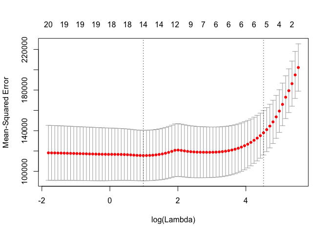

6.subset selection
================
MPM

Use baseball ststs to predict a players salary.

``` r
library(ISLR)
summary(Hitters)
```

    ##      AtBat            Hits         HmRun            Runs       
    ##  Min.   : 16.0   Min.   :  1   Min.   : 0.00   Min.   :  0.00  
    ##  1st Qu.:255.2   1st Qu.: 64   1st Qu.: 4.00   1st Qu.: 30.25  
    ##  Median :379.5   Median : 96   Median : 8.00   Median : 48.00  
    ##  Mean   :380.9   Mean   :101   Mean   :10.77   Mean   : 50.91  
    ##  3rd Qu.:512.0   3rd Qu.:137   3rd Qu.:16.00   3rd Qu.: 69.00  
    ##  Max.   :687.0   Max.   :238   Max.   :40.00   Max.   :130.00  
    ##                                                                
    ##       RBI             Walks            Years            CAtBat       
    ##  Min.   :  0.00   Min.   :  0.00   Min.   : 1.000   Min.   :   19.0  
    ##  1st Qu.: 28.00   1st Qu.: 22.00   1st Qu.: 4.000   1st Qu.:  816.8  
    ##  Median : 44.00   Median : 35.00   Median : 6.000   Median : 1928.0  
    ##  Mean   : 48.03   Mean   : 38.74   Mean   : 7.444   Mean   : 2648.7  
    ##  3rd Qu.: 64.75   3rd Qu.: 53.00   3rd Qu.:11.000   3rd Qu.: 3924.2  
    ##  Max.   :121.00   Max.   :105.00   Max.   :24.000   Max.   :14053.0  
    ##                                                                      
    ##      CHits            CHmRun           CRuns             CRBI        
    ##  Min.   :   4.0   Min.   :  0.00   Min.   :   1.0   Min.   :   0.00  
    ##  1st Qu.: 209.0   1st Qu.: 14.00   1st Qu.: 100.2   1st Qu.:  88.75  
    ##  Median : 508.0   Median : 37.50   Median : 247.0   Median : 220.50  
    ##  Mean   : 717.6   Mean   : 69.49   Mean   : 358.8   Mean   : 330.12  
    ##  3rd Qu.:1059.2   3rd Qu.: 90.00   3rd Qu.: 526.2   3rd Qu.: 426.25  
    ##  Max.   :4256.0   Max.   :548.00   Max.   :2165.0   Max.   :1659.00  
    ##                                                                      
    ##      CWalks        League  Division    PutOuts          Assists     
    ##  Min.   :   0.00   A:175   E:157    Min.   :   0.0   Min.   :  0.0  
    ##  1st Qu.:  67.25   N:147   W:165    1st Qu.: 109.2   1st Qu.:  7.0  
    ##  Median : 170.50                    Median : 212.0   Median : 39.5  
    ##  Mean   : 260.24                    Mean   : 288.9   Mean   :106.9  
    ##  3rd Qu.: 339.25                    3rd Qu.: 325.0   3rd Qu.:166.0  
    ##  Max.   :1566.00                    Max.   :1378.0   Max.   :492.0  
    ##                                                                     
    ##      Errors          Salary       NewLeague
    ##  Min.   : 0.00   Min.   :  67.5   A:176    
    ##  1st Qu.: 3.00   1st Qu.: 190.0   N:146    
    ##  Median : 6.00   Median : 425.0            
    ##  Mean   : 8.04   Mean   : 535.9            
    ##  3rd Qu.:11.00   3rd Qu.: 750.0            
    ##  Max.   :32.00   Max.   :2460.0            
    ##                  NA's   :59

``` r
library(cowplot)
```

    ## Loading required package: ggplot2

    ## 
    ## Attaching package: 'cowplot'

    ## The following object is masked from 'package:ggplot2':
    ## 
    ##     ggsave

``` r
head(Hitters)
```

    ##                   AtBat Hits HmRun Runs RBI Walks Years CAtBat CHits
    ## -Andy Allanson      293   66     1   30  29    14     1    293    66
    ## -Alan Ashby         315   81     7   24  38    39    14   3449   835
    ## -Alvin Davis        479  130    18   66  72    76     3   1624   457
    ## -Andre Dawson       496  141    20   65  78    37    11   5628  1575
    ## -Andres Galarraga   321   87    10   39  42    30     2    396   101
    ## -Alfredo Griffin    594  169     4   74  51    35    11   4408  1133
    ##                   CHmRun CRuns CRBI CWalks League Division PutOuts Assists
    ## -Andy Allanson         1    30   29     14      A        E     446      33
    ## -Alan Ashby           69   321  414    375      N        W     632      43
    ## -Alvin Davis          63   224  266    263      A        W     880      82
    ## -Andre Dawson        225   828  838    354      N        E     200      11
    ## -Andres Galarraga     12    48   46     33      N        E     805      40
    ## -Alfredo Griffin      19   501  336    194      A        W     282     421
    ##                   Errors Salary NewLeague
    ## -Andy Allanson        20     NA         A
    ## -Alan Ashby           10  475.0         N
    ## -Alvin Davis          14  480.0         A
    ## -Andre Dawson          3  500.0         N
    ## -Andres Galarraga      4   91.5         N
    ## -Alfredo Griffin      25  750.0         A

``` r
?Hitters()

hitters = na.omit(Hitters)


# With function
with(hitters, sum(is.na(Salary)))
```

    ## [1] 0

Best subset regression - not applicableto any genomics stuff. This uses
package" Leaps" this works really fast.

``` r
library(leaps)

# run best subset selection on hitters data to predict salary. 
regfit.full = regsubsets(Salary~., data=hitters)
summary(regfit.full)
```

    ## Subset selection object
    ## Call: regsubsets.formula(Salary ~ ., data = hitters)
    ## 19 Variables  (and intercept)
    ##            Forced in Forced out
    ## AtBat          FALSE      FALSE
    ## Hits           FALSE      FALSE
    ## HmRun          FALSE      FALSE
    ## Runs           FALSE      FALSE
    ## RBI            FALSE      FALSE
    ## Walks          FALSE      FALSE
    ## Years          FALSE      FALSE
    ## CAtBat         FALSE      FALSE
    ## CHits          FALSE      FALSE
    ## CHmRun         FALSE      FALSE
    ## CRuns          FALSE      FALSE
    ## CRBI           FALSE      FALSE
    ## CWalks         FALSE      FALSE
    ## LeagueN        FALSE      FALSE
    ## DivisionW      FALSE      FALSE
    ## PutOuts        FALSE      FALSE
    ## Assists        FALSE      FALSE
    ## Errors         FALSE      FALSE
    ## NewLeagueN     FALSE      FALSE
    ## 1 subsets of each size up to 8
    ## Selection Algorithm: exhaustive
    ##          AtBat Hits HmRun Runs RBI Walks Years CAtBat CHits CHmRun CRuns
    ## 1  ( 1 ) " "   " "  " "   " "  " " " "   " "   " "    " "   " "    " "  
    ## 2  ( 1 ) " "   "*"  " "   " "  " " " "   " "   " "    " "   " "    " "  
    ## 3  ( 1 ) " "   "*"  " "   " "  " " " "   " "   " "    " "   " "    " "  
    ## 4  ( 1 ) " "   "*"  " "   " "  " " " "   " "   " "    " "   " "    " "  
    ## 5  ( 1 ) "*"   "*"  " "   " "  " " " "   " "   " "    " "   " "    " "  
    ## 6  ( 1 ) "*"   "*"  " "   " "  " " "*"   " "   " "    " "   " "    " "  
    ## 7  ( 1 ) " "   "*"  " "   " "  " " "*"   " "   "*"    "*"   "*"    " "  
    ## 8  ( 1 ) "*"   "*"  " "   " "  " " "*"   " "   " "    " "   "*"    "*"  
    ##          CRBI CWalks LeagueN DivisionW PutOuts Assists Errors NewLeagueN
    ## 1  ( 1 ) "*"  " "    " "     " "       " "     " "     " "    " "       
    ## 2  ( 1 ) "*"  " "    " "     " "       " "     " "     " "    " "       
    ## 3  ( 1 ) "*"  " "    " "     " "       "*"     " "     " "    " "       
    ## 4  ( 1 ) "*"  " "    " "     "*"       "*"     " "     " "    " "       
    ## 5  ( 1 ) "*"  " "    " "     "*"       "*"     " "     " "    " "       
    ## 6  ( 1 ) "*"  " "    " "     "*"       "*"     " "     " "    " "       
    ## 7  ( 1 ) " "  " "    " "     "*"       "*"     " "     " "    " "       
    ## 8  ( 1 ) " "  "*"    " "     "*"       "*"     " "     " "    " "

How to interpret results above: the rows are model subsets of that size
eg row 1 is model size 1. a star indicates that variable was included in
the best subset of models. The beset subset of size 2 has 2 variables
starred and so on. Remember that from page 209 that forward stepwise
can’t drop variables whereas this method can. Another way of saying
this is the models are not necessarily **nested** in best subset
selection.

this run only used 8 variables but if you want to use all 16 variable
combinations in the model you have to specify as below.

``` r
regfit.full = regsubsets(Salary~., data=hitters, nvmax = 19)

# produce summary for plotting
reg.summary <- summary(regfit.full)
par(mfrow=(c(1,2)))
plot(reg.summary$bic)
plot(reg.summary$adjr2)
```

<!-- -->

So this is the “best” model with 6 predictors given that we have n \> p
and can use this method. p212 - given that the BIC places larger
penalties on larger models it makes sense that BIC is minimized with the
model containing the fewest variables.

R^ 2 increases as variables are included.

plot all of the performance metrics. type = “l” specifies that points
should be connected.

``` r
par(mfrow=c(2,2))
plot(reg.summary$rss ,xlab=" Number of Variables " ,ylab=" RSS" ,type="l" )
plot(reg.summary$adjr2 ,xlab =" Number of Variables " ,ylab=" AdjustedRSq",type= "l" )
plot(reg.summary$cp ,xlab =" Number of Variables " ,ylab=" AdjustedRSq",type= "l" )
plot(reg.summary$bic ,xlab =" Number of Variables " ,ylab=" AdjustedRSq",type= "l" )
```

<!-- -->

There is a built in plotting function which allows you to which can be
used to display the selected variables for the best model with a given
number of predictors ranked according to the performance metrics BIC, Cp
, adjusted R^2 , or AIC.

``` r
plot(regfit.full, scale ="bic")
```

<!-- -->

Walks is probably a surrogate of OBP\! At bats should be regressed out
or these numbers should be limited to players with certain number of at
bats.

``` r
attach(hitters)
salary.model <- lm(Salary ~ (Hits+Walks+CRBI+PutOuts))


plot(salary.model)
```

<!-- --><!-- --><!-- --><!-- -->

Coeficients

``` r
coef(regfit.full ,6)
```

    ##  (Intercept)        AtBat         Hits        Walks         CRBI 
    ##   91.5117981   -1.8685892    7.6043976    3.6976468    0.6430169 
    ##    DivisionW      PutOuts 
    ## -122.9515338    0.2643076

**Forward and Backward Stepwise Selection**

Using the same “leaps” package we can use specify within the
regsubsets() function if we want to use forward or backward selection
and we would get different results as all models will be nested.

In this case the models are identical until 7 variables are included.

``` r
coef(regfit.full ,7)
```

    ##  (Intercept)         Hits        Walks       CAtBat        CHits 
    ##   79.4509472    1.2833513    3.2274264   -0.3752350    1.4957073 
    ##       CHmRun    DivisionW      PutOuts 
    ##    1.4420538 -129.9866432    0.2366813

Now build model with a combination of variable selection and the
training set validation set approach.

In order to use the validation set approach, split the observations into
a training set and a test set.

1)  creating a random vector, train, of elements equal to TRUE if the
    corresponding observation is in the training set, and FALSE
    otherwise.

<!-- end list -->

``` r
set.seed(1)
train <- sample(c(TRUE,FALSE), nrow(hitters), rep=T)
```

2)  create the test vector by creating a vector of vectors not included
    in the training set. the \! in the command to create test causes
    TRUEs to be switched to FALSEs and vice versa.

<!-- end list -->

``` r
test <- (!train)
```

3)  perform best subset selection on the testing data.

<!-- end list -->

``` r
regfit.best=regsubsets (Salary ~ . ,  
                        data=Hitters[train ,],
                        nvmax =19)
```

4)  compute the validation set error for the best model of each model
    size.

<!-- end list -->

  - First create a model matrix
    <https://www.youtube.com/watch?v=Hrr2anyK_5s>

The model.matrix() function is used in many regression packages for
building an “X” matrix from data.

``` r
#create a design matrix
test.mat=model.matrix(Salary ~ ., data=Hitters[test, ])
head(test.mat)
```

    ##                  (Intercept) AtBat Hits HmRun Runs RBI Walks Years CAtBat
    ## -Alvin Davis               1   479  130    18   66  72    76     3   1624
    ## -Andre Dawson              1   496  141    20   65  78    37    11   5628
    ## -Alfredo Griffin           1   594  169     4   74  51    35    11   4408
    ## -Al Newman                 1   185   37     1   23   8    21     2    214
    ## -Argenis Salazar           1   298   73     0   24  24     7     3    509
    ## -Andres Thomas             1   323   81     6   26  32     8     2    341
    ##                  CHits CHmRun CRuns CRBI CWalks LeagueN DivisionW PutOuts
    ## -Alvin Davis       457     63   224  266    263       0         1     880
    ## -Andre Dawson     1575    225   828  838    354       1         0     200
    ## -Alfredo Griffin  1133     19   501  336    194       0         1     282
    ## -Al Newman          42      1    30    9     24       1         0      76
    ## -Argenis Salazar   108      0    41   37     12       0         1     121
    ## -Andres Thomas      86      6    32   34      8       1         1     143
    ##                  Assists Errors NewLeagueN
    ## -Alvin Davis          82     14          0
    ## -Andre Dawson         11      3          1
    ## -Alfredo Griffin     421     25          0
    ## -Al Newman           127      7          0
    ## -Argenis Salazar     283      9          0
    ## -Andres Thomas       290     19          1

4)  part 2

Run a loop and for each model size size i : - extract the coefficients
from regfit.best for the best model of that size, - multiply
coefficients into corrresponding columns of the test model matrix to
form predictions.  
\- compute the test MSE.

``` r
# define val.errors variable outside of the loop
val.errors = rep(NA, 19)


# loop over all model sizes %*% is matrix multiplier. 
for (i in 1:19) {
  coefi <- coef(regfit.best, id=i )
  pred <- test.mat[ ,names(coefi)]%*%coefi
  val.errors[i] <- mean((hitters$Salary[test]-pred)^2)
}
```

    ## Warning in hitters$Salary[test] - pred: longer object length is not a
    ## multiple of shorter object length
    
    ## Warning in hitters$Salary[test] - pred: longer object length is not a
    ## multiple of shorter object length
    
    ## Warning in hitters$Salary[test] - pred: longer object length is not a
    ## multiple of shorter object length
    
    ## Warning in hitters$Salary[test] - pred: longer object length is not a
    ## multiple of shorter object length
    
    ## Warning in hitters$Salary[test] - pred: longer object length is not a
    ## multiple of shorter object length
    
    ## Warning in hitters$Salary[test] - pred: longer object length is not a
    ## multiple of shorter object length
    
    ## Warning in hitters$Salary[test] - pred: longer object length is not a
    ## multiple of shorter object length
    
    ## Warning in hitters$Salary[test] - pred: longer object length is not a
    ## multiple of shorter object length
    
    ## Warning in hitters$Salary[test] - pred: longer object length is not a
    ## multiple of shorter object length
    
    ## Warning in hitters$Salary[test] - pred: longer object length is not a
    ## multiple of shorter object length
    
    ## Warning in hitters$Salary[test] - pred: longer object length is not a
    ## multiple of shorter object length
    
    ## Warning in hitters$Salary[test] - pred: longer object length is not a
    ## multiple of shorter object length
    
    ## Warning in hitters$Salary[test] - pred: longer object length is not a
    ## multiple of shorter object length
    
    ## Warning in hitters$Salary[test] - pred: longer object length is not a
    ## multiple of shorter object length
    
    ## Warning in hitters$Salary[test] - pred: longer object length is not a
    ## multiple of shorter object length
    
    ## Warning in hitters$Salary[test] - pred: longer object length is not a
    ## multiple of shorter object length
    
    ## Warning in hitters$Salary[test] - pred: longer object length is not a
    ## multiple of shorter object length
    
    ## Warning in hitters$Salary[test] - pred: longer object length is not a
    ## multiple of shorter object length
    
    ## Warning in hitters$Salary[test] - pred: longer object length is not a
    ## multiple of shorter object length

``` r
#plot results 
plot(val.errors, xlab = "number of model parameters", ylab = "validation set MSE")
```

<!-- -->

Finally do best subset regression on the full dataset.

It’s recommended I use the best 10 variable subset when evaluating the
method on the full dataset, not necesserily those same variables.
important caveat.

``` r
#fulldataset 
regfit.best <- regsubsets(Salary ~ . , data = hitters, nvmax = 19)
coef(regfit.best, 10)
```

    ##  (Intercept)        AtBat         Hits        Walks       CAtBat 
    ##  162.5354420   -2.1686501    6.9180175    5.7732246   -0.1300798 
    ##        CRuns         CRBI       CWalks    DivisionW      PutOuts 
    ##    1.4082490    0.7743122   -0.8308264 -112.3800575    0.2973726 
    ##      Assists 
    ##    0.2831680

We see that there is a different set of 10 variables here…

We can generalize this into an r function:

``` r
predict.regsubsets = function(object, newdata, id, ...) {
    form = as.formula(object$call[[2]])
    mat = model.matrix(form, newdata)
    coefi = coef(object, id = id)
    mat[, names(coefi)] %*% coefi
}
```

Now can choose among the models of different sizes with a cross
validation approach. Have to do subset selecton on each of the k
training sets.

## Model Selection by Cross-Validation

We will do 10-fold cross-validation.

``` r
set.seed(1)
# creat a random sample of numbers from 1 to 10 with a length = nrows(hitters)
folds=sample(rep(1:10,length=nrow(hitters)))
table(folds) 
```

    ## folds
    ##  1  2  3  4  5  6  7  8  9 10 
    ## 27 27 27 26 26 26 26 26 26 26

``` r
# Create a matrix for errors. 10 rows (folds) by 19 subsets (variables) 
cv.errors=matrix(NA,10,19)


# best subset selection on Hitters data not part of k. 
for(k in 1:10){
  best.fit=regsubsets(Salary ~ ., 
                      data=hitters[folds!=k, ],
                      nvmax=19, 
                      method="forward")
  for(i in 1:19){
    pred=predict.regsubsets(best.fit,hitters[folds==k, ], id=i) # make predictions for each subset size I of the data that was left out. 
    cv.errors[k,i] = mean((hitters$Salary[folds==k]-pred)^2) # mean square error of predictions. 
  }
}
```

Taking apart the loop and
function

``` r
# each fold of hitters that we subset with hitters[folds!=k, ] is one of the 10 fold subsets. 
dim(hitters) # 263  20
```

    ## [1] 263  20

``` r
dim(hitters[folds!=2, ]) # 236 20 etc. 
```

    ## [1] 236  20

``` r
# cv errors is a matrix of MSE each computed for 19 model sizes over each of 10 folds. 
cv.errors[1:5, 1:5]
```

    ##           [,1]      [,2]      [,3]      [,4]      [,5]
    ## [1,] 219322.99 179995.82 189458.68 178509.92 167697.80
    ## [2,]  67560.95  61315.50  58587.55  47276.35  54088.37
    ## [3,] 260657.90 321568.89 310511.99 323542.82 308610.68
    ## [4,]  80277.33  54109.93  48153.07  43385.47  44149.77
    ## [5,] 128220.96 124909.04 132340.57 130355.60 148868.23

Now we can get the mean od the MSE for each model size that was made
with 10 fold cross
validation.

``` r
rmse.cv=sqrt(apply(cv.errors,2,mean)) # 10 rows each row was a MSE for a particular row. 
plot(rmse.cv,pch=19,type="b")
```

<!-- -->

**Ridge and lasso**

## Ridge Regression and the Lasso

We will use the package `glmnet`, which does not use the model formula
language, so we will set up an `x` and `y`.

``` r
library(ISLR)
library(glmnet)
```

    ## Loading required package: Matrix

    ## Loading required package: foreach

    ## Loaded glmnet 2.0-18

``` r
dx = x=model.matrix(Salary~.-1,data=Hitters) 
dy = y=Hitters$Salary
```

First we will fit a ridge-regression model. This is achieved by calling
`glmnet` with `alpha=0` (see the helpfile). There is also a `cv.glmnet`
function which will do the cross-validation for us.

``` r
y = y[!is.na(y)]
fit.ridge=glmnet(x,y,alpha=0)
plot(fit.ridge,xvar="lambda",label=TRUE)
```

<!-- -->

``` r
cv.ridge=cv.glmnet(x,y,alpha=0)
plot(cv.ridge)
```

<!-- -->
Now we fit a lasso model; for this we use the default `alpha=1`

``` r
fit.lasso=glmnet(x,y)
plot(fit.lasso,xvar="lambda",label=TRUE)
```

<!-- -->

``` r
cv.lasso=cv.glmnet(x,y)
plot(cv.lasso)
```

<!-- -->

``` r
coef(cv.lasso)
```

    ## 21 x 1 sparse Matrix of class "dgCMatrix"
    ##                        1
    ## (Intercept) 193.74263886
    ## AtBat         .         
    ## Hits          1.21471320
    ## HmRun         .         
    ## Runs          .         
    ## RBI           .         
    ## Walks         1.28957901
    ## Years         .         
    ## CAtBat        .         
    ## CHits         .         
    ## CHmRun        .         
    ## CRuns         0.12923755
    ## CRBI          0.31515925
    ## CWalks        .         
    ## LeagueA       .         
    ## LeagueN       .         
    ## DivisionW     .         
    ## PutOuts       0.02533305
    ## Assists       .         
    ## Errors        .         
    ## NewLeagueN    .

Suppose we want to use our earlier train/validation division to select
the `lambda` for the lasso. This is easy to do.

``` r
lasso.tr=glmnet(x[train,],y[train])
lasso.tr
```

    ## 
    ## Call:  glmnet(x = x[train, ], y = y[train]) 
    ## 
    ##        Df    %Dev    Lambda
    ##   [1,]  0 0.00000 227.90000
    ##   [2,]  1 0.05371 207.60000
    ##   [3,]  3 0.11810 189.20000
    ##   [4,]  3 0.18370 172.40000
    ##   [5,]  3 0.23820 157.10000
    ##   [6,]  3 0.28340 143.10000
    ##   [7,]  3 0.32090 130.40000
    ##   [8,]  3 0.35210 118.80000
    ##   [9,]  3 0.37800 108.30000
    ##  [10,]  3 0.39940  98.64000
    ##  [11,]  3 0.41730  89.88000
    ##  [12,]  3 0.43210  81.89000
    ##  [13,]  4 0.44850  74.62000
    ##  [14,]  4 0.46260  67.99000
    ##  [15,]  4 0.47420  61.95000
    ##  [16,]  4 0.48390  56.45000
    ##  [17,]  4 0.49200  51.43000
    ##  [18,]  4 0.49860  46.86000
    ##  [19,]  6 0.50430  42.70000
    ##  [20,]  7 0.51170  38.91000
    ##  [21,]  8 0.52040  35.45000
    ##  [22,]  8 0.52840  32.30000
    ##  [23,]  8 0.53500  29.43000
    ##  [24,]  8 0.54050  26.82000
    ##  [25,]  8 0.54510  24.43000
    ##  [26,]  8 0.54880  22.26000
    ##  [27,]  8 0.55200  20.29000
    ##  [28,]  8 0.55460  18.48000
    ##  [29,]  8 0.55680  16.84000
    ##  [30,]  8 0.55860  15.35000
    ##  [31,]  8 0.56010  13.98000
    ##  [32,]  8 0.56130  12.74000
    ##  [33,]  8 0.56230  11.61000
    ##  [34,]  8 0.56320  10.58000
    ##  [35,]  8 0.56390   9.63700
    ##  [36,] 10 0.56550   8.78100
    ##  [37,] 10 0.56780   8.00100
    ##  [38,] 11 0.57060   7.29000
    ##  [39,] 12 0.57400   6.64300
    ##  [40,] 15 0.58000   6.05300
    ##  [41,] 15 0.58560   5.51500
    ##  [42,] 15 0.59030   5.02500
    ##  [43,] 15 0.59420   4.57900
    ##  [44,] 16 0.59780   4.17200
    ##  [45,] 16 0.60070   3.80100
    ##  [46,] 16 0.60330   3.46400
    ##  [47,] 16 0.60540   3.15600
    ##  [48,] 16 0.60710   2.87500
    ##  [49,] 16 0.60860   2.62000
    ##  [50,] 16 0.60980   2.38700
    ##  [51,] 16 0.61080   2.17500
    ##  [52,] 16 0.61170   1.98200
    ##  [53,] 16 0.61240   1.80600
    ##  [54,] 16 0.61290   1.64500
    ##  [55,] 16 0.61340   1.49900
    ##  [56,] 17 0.61380   1.36600
    ##  [57,] 17 0.61430   1.24500
    ##  [58,] 17 0.61470   1.13400
    ##  [59,] 17 0.61500   1.03300
    ##  [60,] 17 0.61530   0.94160
    ##  [61,] 17 0.61550   0.85790
    ##  [62,] 18 0.61600   0.78170
    ##  [63,] 19 0.61690   0.71230
    ##  [64,] 19 0.61750   0.64900
    ##  [65,] 19 0.61810   0.59130
    ##  [66,] 19 0.61850   0.53880
    ##  [67,] 19 0.61890   0.49090
    ##  [68,] 19 0.61920   0.44730
    ##  [69,] 19 0.61940   0.40760
    ##  [70,] 20 0.61970   0.37140
    ##  [71,] 20 0.61980   0.33840
    ##  [72,] 20 0.62040   0.30830
    ##  [73,] 20 0.62050   0.28090
    ##  [74,] 20 0.62060   0.25600
    ##  [75,] 20 0.62080   0.23320
    ##  [76,] 20 0.62100   0.21250
    ##  [77,] 20 0.62120   0.19360
    ##  [78,] 20 0.62130   0.17640
    ##  [79,] 20 0.62150   0.16080
    ##  [80,] 20 0.62160   0.14650
    ##  [81,] 20 0.62170   0.13350
    ##  [82,] 20 0.62170   0.12160
    ##  [83,] 20 0.62180   0.11080
    ##  [84,] 20 0.62190   0.10100
    ##  [85,] 20 0.62190   0.09199
    ##  [86,] 20 0.62200   0.08382
    ##  [87,] 20 0.62200   0.07637
    ##  [88,] 20 0.62200   0.06959
    ##  [89,] 20 0.62210   0.06341
    ##  [90,] 20 0.62210   0.05777
    ##  [91,] 20 0.62210   0.05264
    ##  [92,] 20 0.62210   0.04797
    ##  [93,] 20 0.62210   0.04370
    ##  [94,] 20 0.62210   0.03982
    ##  [95,] 20 0.62220   0.03628
    ##  [96,] 20 0.62220   0.03306
    ##  [97,] 20 0.62220   0.03012
    ##  [98,] 19 0.62220   0.02745
    ##  [99,] 19 0.62220   0.02501
    ## [100,] 20 0.62220   0.02279

``` r
pred=predict(lasso.tr,x[-train,])
dim(pred)
```

    ## [1] 262 100

``` r
rmse= sqrt(apply((y[-train]-pred)^2,2,mean))
plot(log(lasso.tr$lambda),rmse,type="b",xlab="Log(lambda)")
```

<!-- -->

``` r
lam.best=lasso.tr$lambda[order(rmse)[1]]
lam.best
```

    ## [1] 0.3383881

``` r
coef(lasso.tr,s=lam.best)
```

    ## 21 x 1 sparse Matrix of class "dgCMatrix"
    ##                         1
    ## (Intercept)  1.083641e+02
    ## AtBat       -1.374384e+00
    ## Hits         7.299676e+00
    ## HmRun        1.280489e+00
    ## Runs        -1.088269e+00
    ## RBI          4.456767e-01
    ## Walks        4.055146e+00
    ## Years       -8.057846e+00
    ## CAtBat      -7.225330e-02
    ## CHits        9.174412e-01
    ## CHmRun       1.473238e+00
    ## CRuns       -2.087407e-04
    ## CRBI        -3.040298e-01
    ## CWalks      -8.325765e-01
    ## LeagueA     -1.701904e+02
    ## LeagueN      7.395803e-10
    ## DivisionW   -5.598193e+01
    ## PutOuts      2.200533e-01
    ## Assists     -1.335222e-01
    ## Errors      -3.082320e+00
    ## NewLeagueN  -9.332314e+01
