7\. Non-linear modeling
================

Important section is GAMS. There are situations when nonlinearity in an
individual predictor is really obvious e.g. an example is given wheere
10 fold cross validated errors are highly minimized by simply adding a
extra degree of freedomin the form of a regression spline fit to that
predictor instead of forcing a line through the data.

With polynomial regression, in general, fits are not optimal at the high
and low values of the predictors. Not used often. If we need some wiggly
line to fit a response variable then you need a really high order
polynomial, producing unreasonable predictions at the boundaries. it is
much more stable to instead keep the degree fixed, like x^3 but use an
increased number of knots in the data to locally fit the areas of
non-linearity, introducing a *natural spline* also stabilizes estimates
at the boundaries by forcing linear fit at those regions.

#### Topics

  - Polynomial regression

  - Regression Splines
    
      - Piecewise polynomials  
      - includes spline basis representation e.g. cubic basis splines.  

  - Step functions  
    These use arbitrary cut points like 5 year age bins then fitting
    within bin.

  - Smoothing splines (see equation p 227)
    
      - instead of using knots, we minimize a loss + smoothness equation
        of the same form as in elasticnet; we introduce smoothness by a
        tuning parameter times the second derivative of the function fit
        to the data which is a measure of how ‘bumpy’ the function is.
        The tuning parameter value at infinity = no penalty = wiggily
        fit = low *bias*.  

  - Local regression (see figure p 281)
    
      - this perforoms poorly when p \> 3 or 4.  

  - Generalized Additive models (GAM)  
    instead of y ~ beta1(x1) + beta2(x2) …, we fit y ~ f1(xi1) + f2(xi2)
    + …. calculating a separate f() for each x then add all of the
    contributions together to predict y. As with generalized linear
    models, the model is restricted to be additive, but we can manually
    add interaction terms as well.

[Good article on GAMs](http://environmentalcomputing.net/intro-to-gams/)

##### data

setting up data

``` r
library(ISLR)
suppressMessages(library(tidyverse))
d = Wage
str(d)
```

    ## 'data.frame':    3000 obs. of  11 variables:
    ##  $ year      : int  2006 2004 2003 2003 2005 2008 2009 2008 2006 2004 ...
    ##  $ age       : int  18 24 45 43 50 54 44 30 41 52 ...
    ##  $ maritl    : Factor w/ 5 levels "1. Never Married",..: 1 1 2 2 4 2 2 1 1 2 ...
    ##  $ race      : Factor w/ 4 levels "1. White","2. Black",..: 1 1 1 3 1 1 4 3 2 1 ...
    ##  $ education : Factor w/ 5 levels "1. < HS Grad",..: 1 4 3 4 2 4 3 3 3 2 ...
    ##  $ region    : Factor w/ 9 levels "1. New England",..: 2 2 2 2 2 2 2 2 2 2 ...
    ##  $ jobclass  : Factor w/ 2 levels "1. Industrial",..: 1 2 1 2 2 2 1 2 2 2 ...
    ##  $ health    : Factor w/ 2 levels "1. <=Good","2. >=Very Good": 1 2 1 2 1 2 2 1 2 2 ...
    ##  $ health_ins: Factor w/ 2 levels "1. Yes","2. No": 2 2 1 1 1 1 1 1 1 1 ...
    ##  $ logwage   : num  4.32 4.26 4.88 5.04 4.32 ...
    ##  $ wage      : num  75 70.5 131 154.7 75 ...

``` r
colnames(d)
```

    ##  [1] "year"       "age"        "maritl"     "race"       "education" 
    ##  [6] "region"     "jobclass"   "health"     "health_ins" "logwage"   
    ## [11] "wage"

``` r
d %>% colnames
```

    ##  [1] "year"       "age"        "maritl"     "race"       "education" 
    ##  [6] "region"     "jobclass"   "health"     "health_ins" "logwage"   
    ## [11] "wage"

``` r
d = d %>% droplevels()
d$region %>% unique 
```

    ## [1] 2. Middle Atlantic
    ## Levels: 2. Middle Atlantic

## Polynomial regression

Predicting wage with a 4th degree polynomial on age.  
poly returns a matrix of a basis of orthogonal polynomials. Each column
is a linear combination of age, age^2, age^3 … Think this is the
eigenvalue of the poynomial matrix based on the prcomp

``` r
f1 = wage ~ poly(age,4)
# what id poly doing? 
X = poly(d$age,4)
corrplot::cor.mtest(X)
```

    ## $p
    ##      [,1] [,2] [,3] [,4]
    ## [1,]    0    1    1    1
    ## [2,]    1    0    1    1
    ## [3,]    1    1    0    1
    ## [4,]    1    1    1    0
    ## 
    ## $lowCI
    ##            [,1]       [,2]       [,3]       [,4]
    ## [1,]  1.0000000 -0.0357865 -0.0357865 -0.0357865
    ## [2,] -0.0357865  1.0000000 -0.0357865 -0.0357865
    ## [3,] -0.0357865 -0.0357865  1.0000000 -0.0357865
    ## [4,] -0.0357865 -0.0357865 -0.0357865  1.0000000
    ## 
    ## $uppCI
    ##           [,1]      [,2]      [,3]      [,4]
    ## [1,] 1.0000000 0.0357865 0.0357865 0.0357865
    ## [2,] 0.0357865 1.0000000 0.0357865 0.0357865
    ## [3,] 0.0357865 0.0357865 1.0000000 0.0357865
    ## [4,] 0.0357865 0.0357865 0.0357865 1.0000000

``` r
pc = prcomp(X)
pc$rotation
```

    ##   PC1        PC2        PC3        PC4
    ## 1   1  0.0000000  0.0000000  0.0000000
    ## 2   0 -0.9284203  0.3176987  0.1926220
    ## 3   0 -0.1181067 -0.7439335  0.6577338
    ## 4   0 -0.3522591 -0.5879035 -0.7282053

``` r
pheatmap::pheatmap(poly(d$age,4))
```

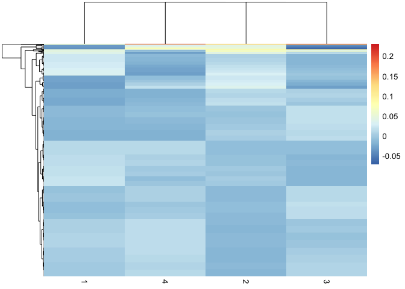<!-- -->

Fitting the model :

``` r
fit = lm(formula = f1, data = d)
coef(summary(fit))
```

    ##                 Estimate Std. Error    t value     Pr(>|t|)
    ## (Intercept)    111.70361  0.7287409 153.283015 0.000000e+00
    ## poly(age, 4)1  447.06785 39.9147851  11.200558 1.484604e-28
    ## poly(age, 4)2 -478.31581 39.9147851 -11.983424 2.355831e-32
    ## poly(age, 4)3  125.52169 39.9147851   3.144742 1.678622e-03
    ## poly(age, 4)4  -77.91118 39.9147851  -1.951938 5.103865e-02

WE can also fit age, age^2 age^3 directly with RAW = T. This doesnt
impact the fitted values only hte coefficients.

``` r
f2 = wage ~ poly(age,4, raw = TRUE)
fit2 = lm(formula = f2, data = d)
coef(summary(fit2))
```

    ##                                Estimate   Std. Error   t value
    ## (Intercept)               -1.841542e+02 6.004038e+01 -3.067172
    ## poly(age, 4, raw = TRUE)1  2.124552e+01 5.886748e+00  3.609042
    ## poly(age, 4, raw = TRUE)2 -5.638593e-01 2.061083e-01 -2.735743
    ## poly(age, 4, raw = TRUE)3  6.810688e-03 3.065931e-03  2.221409
    ## poly(age, 4, raw = TRUE)4 -3.203830e-05 1.641359e-05 -1.951938
    ##                               Pr(>|t|)
    ## (Intercept)               0.0021802539
    ## poly(age, 4, raw = TRUE)1 0.0003123618
    ## poly(age, 4, raw = TRUE)2 0.0062606446
    ## poly(age, 4, raw = TRUE)3 0.0263977518
    ## poly(age, 4, raw = TRUE)4 0.0510386498

Simulate a grid of ages to make predictions on, then predict with the
polynomial function.

``` r
# simulate ages with hte same range of the original values 
age.grid = seq(from = min(range(d$age)), to = max(range(d$age)))

# predict with model 2 
preds = predict(object = fit2, newdata = list(age = age.grid), se.fit = TRUE)

# calculate standard errors 
dfit= data.frame(prediction = preds$fit, SE1 = preds$fit+2*preds$se.fit, SE2 = preds$fit-2*preds$se.fit)
ggplot(dfit, aes(x = age.grid, y = prediction)) + 
  geom_point() + 
  geom_errorbar(aes(ymin=prediction-SE2, ymax=prediction+SE1)) 
```

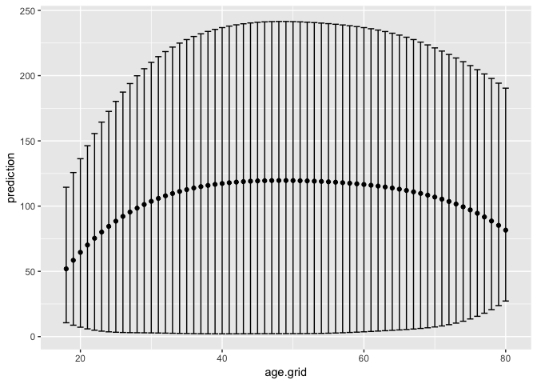<!-- -->

One way to select the degree of the polynomial we could fit is to use
analysis of variance of the nested models m1-m5 comaring linear up to a
5th degree polynomial. The p values of an anova fit to the models
reflects the model vs the one level below in complexity.

``` r
degree = 1:5 %>% as.list()

fits = lapply(degree, function(x){ 
  lm(wage ~ poly(age, degree = x),
     data = d)
  })

anova(fits[[1]], fits[[2]], fits[[3]], fits[[4]], fits[[5]])
```

    ## Analysis of Variance Table
    ## 
    ## Model 1: wage ~ poly(age, degree = x)
    ## Model 2: wage ~ poly(age, degree = x)
    ## Model 3: wage ~ poly(age, degree = x)
    ## Model 4: wage ~ poly(age, degree = x)
    ## Model 5: wage ~ poly(age, degree = x)
    ##   Res.Df     RSS Df Sum of Sq        F    Pr(>F)    
    ## 1   2998 5022216                                    
    ## 2   2997 4793430  1    228786 143.5931 < 2.2e-16 ***
    ## 3   2996 4777674  1     15756   9.8888  0.001679 ** 
    ## 4   2995 4771604  1      6070   3.8098  0.051046 .  
    ## 5   2994 4770322  1      1283   0.8050  0.369682    
    ## ---
    ## Signif. codes:  0 '***' 0.001 '**' 0.01 '*' 0.05 '.' 0.1 ' ' 1

This line:

2 2997 4793430 1 228786 143.5931 \< 2.2e-16 \*\*\*

The p value here is from an F-test comparing m1 (linear regression) to
m2 (degree 2 polynomial fit). And so on and so forth…so the 5 degree
polynomial is overkill and does not reduce variance explained compared
to the 4-degree polynomial.

Structuring the problem as classification: predict whether a person
makes \>250k per year

``` r
d$class = ifelse(d$wage>250, 1, 0)
d$class %>% table
```

    ## .
    ##    0    1 
    ## 2921   79

``` r
f4 = as.formula(class ~ poly(age, 4))
fit3 = glm(formula = f4, data = d, family = 'binomial')
summary(fit3)
```

    ## 
    ## Call:
    ## glm(formula = f4, family = "binomial", data = d)
    ## 
    ## Deviance Residuals: 
    ##     Min       1Q   Median       3Q      Max  
    ## -0.3110  -0.2607  -0.2488  -0.1791   3.7859  
    ## 
    ## Coefficients:
    ##               Estimate Std. Error z value Pr(>|z|)    
    ## (Intercept)    -4.3012     0.3451 -12.465  < 2e-16 ***
    ## poly(age, 4)1  71.9642    26.1176   2.755  0.00586 ** 
    ## poly(age, 4)2 -85.7729    35.9043  -2.389  0.01690 *  
    ## poly(age, 4)3  34.1626    19.6890   1.735  0.08272 .  
    ## poly(age, 4)4 -47.4008    24.0909  -1.968  0.04912 *  
    ## ---
    ## Signif. codes:  0 '***' 0.001 '**' 0.01 '*' 0.05 '.' 0.1 ' ' 1
    ## 
    ## (Dispersion parameter for binomial family taken to be 1)
    ## 
    ##     Null deviance: 730.53  on 2999  degrees of freedom
    ## Residual deviance: 701.22  on 2995  degrees of freedom
    ## AIC: 711.22
    ## 
    ## Number of Fisher Scoring iterations: 9

This uses a logit link function, so to get predictions on the original
scale, we use type = ’respons in the `predict` function. I am not
certain why these SEsa re not centered about the predicted values at
higher values of
age….

``` r
preds4 = predict(fit3, newdata = list(age = age.grid), type = 'response',se.fit = TRUE)

dfit = data.frame(prediction = preds4$fit, SE1 = preds4$fit+2*preds4$se.fit, SE2 = preds4$fit-2*preds4$se.fit)
ggplot(dfit, aes(x = age.grid, y = prediction)) + 
  geom_point() + 
  geom_errorbar(aes(ymin=prediction-SE2, ymax=prediction+SE1)) 
```

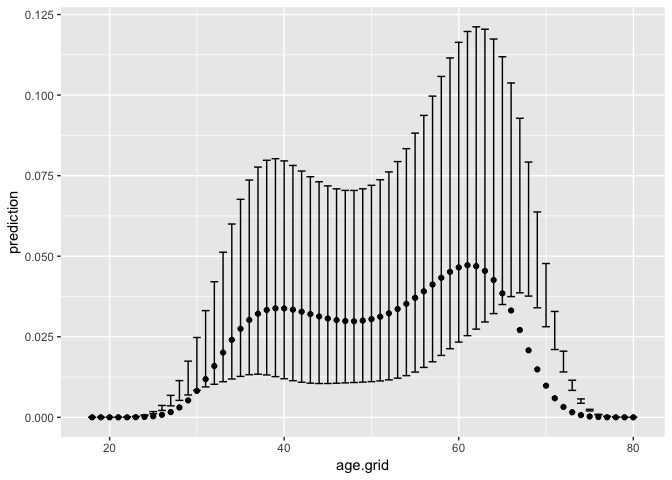<!-- -->

Plotting this directly in ggplot against the original values:

``` r
attach(Wage)
ggplot(d, aes(x = age, y = wage)) + 
  geom_point(size  = 0.3, alpha = 0.2) + 
  geom_smooth(method = 'lm',formula = y ~ poly(x,4))
```

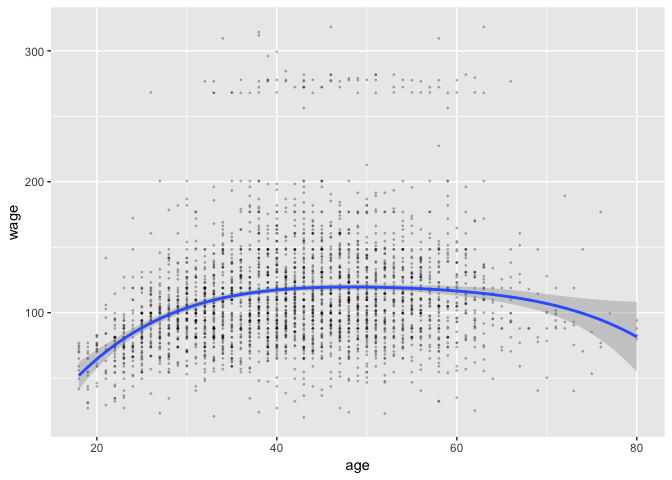<!-- -->

``` r
plot(age,I(wage >250),xlim= c(0,100), type="n",ylim=c(0,.2))
points(jitter(age), I((wage >250) /5), cex = .5, pch ="|", col = "darkgrey")
lines(age.grid, preds$fit,lwd =2, col = "blue")
matlines(age.grid, cbind(dfit$SE1, dfit$SE2) ,lwd =1, col =" blue" ,lty =3)
```

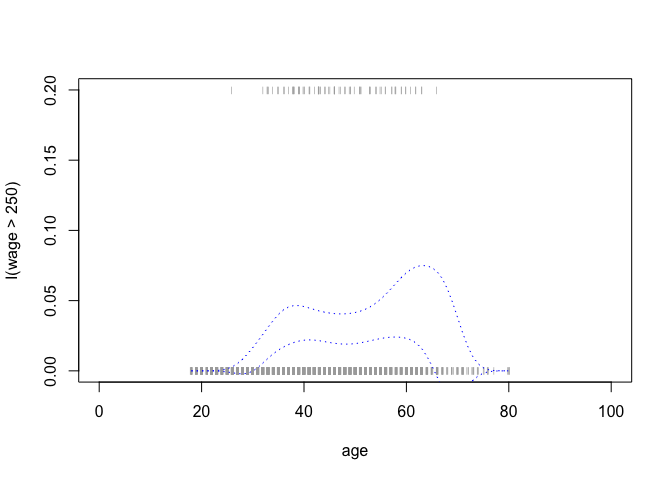<!-- -->

## Step Functions

?cut – cut divides the range of x into intervals and codes the values in
x according to which interval they fall.

``` r
table(cut(d$age, breaks = 4))
```

    ## 
    ## (17.9,33.5]   (33.5,49]   (49,64.5] (64.5,80.1] 
    ##         750        1399         779          72

``` r
# note that as formula captures the function call. 
f5 = as.formula(wage ~ cut(d$age, breaks = 4))
# fit 
fit5 = lm(formula = f5,data = d)
coef(summary(fit5))
```

    ##                                    Estimate Std. Error   t value
    ## (Intercept)                       94.158392   1.476069 63.789970
    ## cut(d$age, breaks = 4)(33.5,49]   24.053491   1.829431 13.148074
    ## cut(d$age, breaks = 4)(49,64.5]   23.664559   2.067958 11.443444
    ## cut(d$age, breaks = 4)(64.5,80.1]  7.640592   4.987424  1.531972
    ##                                       Pr(>|t|)
    ## (Intercept)                       0.000000e+00
    ## cut(d$age, breaks = 4)(33.5,49]   1.982315e-38
    ## cut(d$age, breaks = 4)(49,64.5]   1.040750e-29
    ## cut(d$age, breaks = 4)(64.5,80.1] 1.256350e-01

The intercept term coefficient represents the average salary of those
under 35 which was $94k. Wow I’m apparently poor.

## Splines

using the argument df, we can specify a spline fit at uniform quantiles
of the predictor variable:

``` r
library(splines)
# cubic basis spline( degree 3 is the default). 
f6 = wage ~ bs(age,df = 6, degree = 3)
fit6 = lm(formula = f6, data = d)
coef(summary(fit6))
```

    ##                              Estimate Std. Error   t value     Pr(>|t|)
    ## (Intercept)                  56.31384   7.258043 7.7588188 1.167133e-14
    ## bs(age, df = 6, degree = 3)1 27.82400  12.434548 2.2376369 2.531805e-02
    ## bs(age, df = 6, degree = 3)2 54.06255   7.127490 7.5850746 4.407445e-14
    ## bs(age, df = 6, degree = 3)3 65.82839   8.323418 7.9088174 3.623715e-15
    ## bs(age, df = 6, degree = 3)4 55.81273   8.723974 6.3976272 1.825054e-10
    ## bs(age, df = 6, degree = 3)5 72.13147  13.744891 5.2478751 1.646050e-07
    ## bs(age, df = 6, degree = 3)6 14.75088  16.208690 0.9100597 3.628643e-01

``` r
pred = predict(object = fit6, newdata = list(age = age.grid),se.fit = T)
plot(age.grid, pred$fit)
```

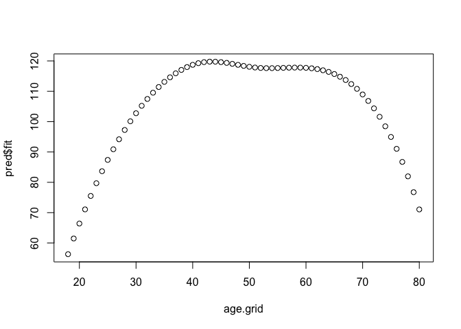<!-- -->

#### Natural splines

We can also fit a natrual spline which will result in constrained linear
fits at the beginning and end of the prediction interval. The plot below
suggests the basis spline above was influenced by some highly leveraged
points at high value of age.

``` r
f7 = wage ~ ns(age,df = 6)
fit7 = lm(formula = f7, data = d)
pred = predict(object = fit7, newdata = list(age = age.grid),se.fit = T)
plot(age.grid, pred$fit)
```

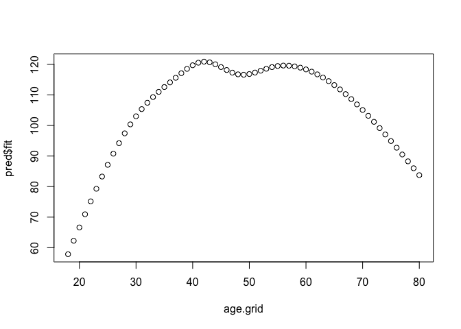<!-- -->

#### Smoothing Splines

Smoothing splines are a completely different formulation that take the
form of the loss + penalty formulation used in ridge / lasso. The tuning
parameter determines the penalty for the 2nd derivative of the function
which determines the number of turns.

The `cv` argument in smooth.spline does leave one out cross
    validation.

``` r
fit9 = smooth.spline(x = d$age, y = d$wage, cv = TRUE)
```

    ## Warning in smooth.spline(x = d$age, y = d$wage, cv = TRUE): cross-
    ## validation with non-unique 'x' values seems doubtful

``` r
fit9$df
```

    ## [1] 6.794596

The cross validation pocedure selected a value of lambda that yields 6.8
defrees of freedom.

``` r
preds = predict(object = fit9, newdata = list(age = age.grid))
plot(preds$x,preds$y)
```

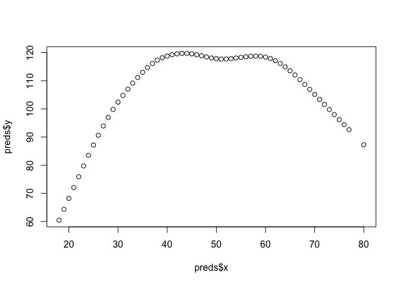<!-- -->

## Local regression

see the locfit package

This perroms local regression with each neighborhood consisting of 20%
of the data

``` r
fit10 = loess(formula = wage ~ age, span = 0.2, data = d)
plot(fit10$fitted,  fit10$residuals)
```

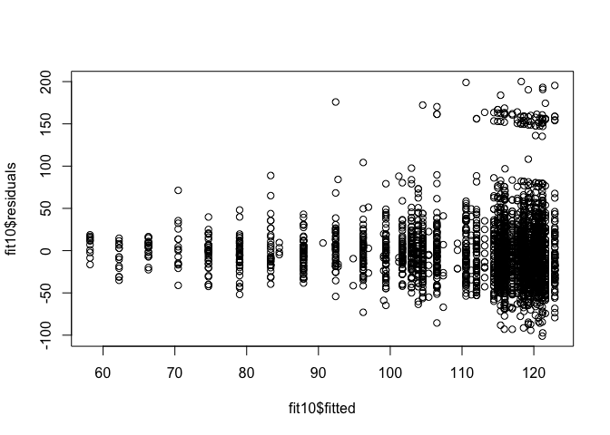<!-- -->

``` r
# now we convert age to data frame in this predict call.. 
preds = predict(object = fit10, data.frame(age = age.grid))

plot(x = age.grid, preds)
```

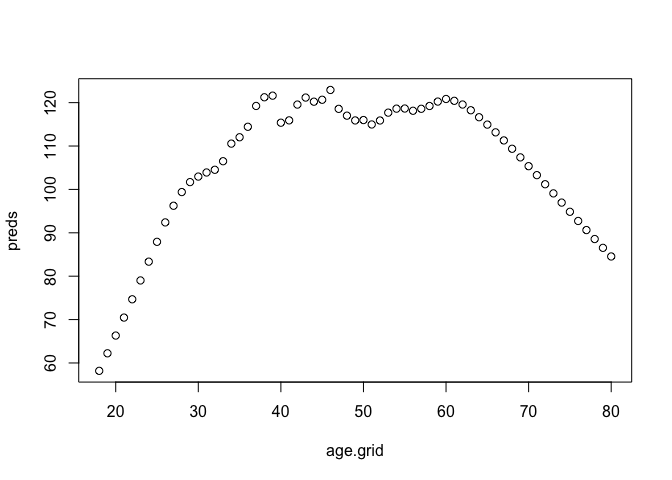<!-- -->

## Generalized Additive Models

Generalized additive model where rather than modeling beta(x) we model
f1(x1) + f2(x2) …

Fitting a natural spline (linear at ends) function of year and age with
education as a qualitative predictor.

``` r
# model formula
f_gam = as.formula(wage ~ ns(year,df = 4) + ns(age, df = 5) + education)

# GAM 
gam = lm(formula = f_gam, data = d)

# plot
suppressMessages(library(gam))
par(mfrow = c(1,3))
plot.Gam(gam, se = TRUE)
```

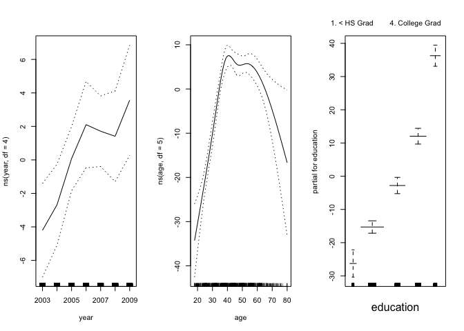<!-- -->

The above plot interpretation: Comparing people with the same age and
level of education, the effect of year on wage increases with some
slowing in 2008. Controlling for the year and a person’s age, ie.
holding age and year fixed the effect of education is to increase wage.
From linked artice above:  
*You can essentially present model results from a GAM as if it were any
other linear model, the main difference being that for the smooth terms,
there is no single coefficient you can make inference from
(i.e. negative, positive, effect size etc.). So you need to rely on
either interpretting the parital effects of the smooth terms visually
(e.g. from a call to plot(gam\_model)) or make inference from the
predicted values. You can of course include normal linear terms in the
model (either continuous or categorical, and in an ANOVA type framework
even) and make inference from them like you normally would. Indeed, GAMs
are often useful for accounting for a non-linear phenomonon that is not
directly of interest, but needs to be acocunted for when making inferece
about other variables.*

There is a gam package for doing more complicated fits for things that
cant be expressed with basis functions.  
The `s()` function in the gam package specifies a smoothing spline.
Again this is fitting the model below where each function is a smoothing
spline with an a priori defined degrees of freedom.  
wage = beta0 + f1(year) + f2(age) + f3(education) + errors

``` r
suppressMessages(library(gam))
fgam3 = as.formula(wage ~ s(year, df = 4) + s(age, df = 5) + education)
gam.m3 = gam::gam(formula = fgam3, data = d)

# plot of figure 7.12 
par(mfrow=c(1,3))
plot(gam.m3, se = TRUE, col = 'deepskyblue3')
```

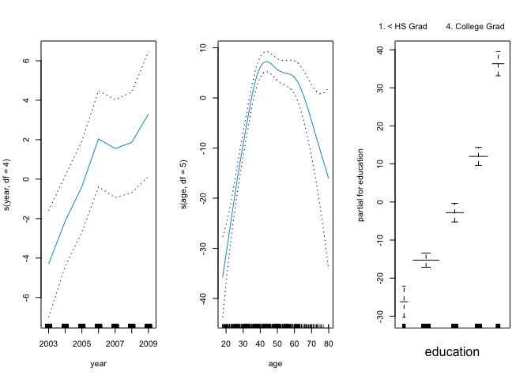<!-- -->

The amount of inflation from 2003 to 2009 might be more linear or might
not need to e controlled for; investigating this with anova.

``` r
f1 = as.formula(wage ~ s(age,5) + education)
f2 = as.formula(wage ~ year + s(age,5) + education)
gam1 = gam::gam(formula = f1,data = d)
gam2 = gam::gam(formula = f2,data = d)
anova(gam1, gam2, gam.m3, test = "F")
```

    ## Analysis of Deviance Table
    ## 
    ## Model 1: wage ~ s(age, 5) + education
    ## Model 2: wage ~ year + s(age, 5) + education
    ## Model 3: wage ~ s(year, df = 4) + s(age, df = 5) + education
    ##   Resid. Df Resid. Dev Df Deviance       F    Pr(>F)    
    ## 1      2990    3711731                                  
    ## 2      2989    3693842  1  17889.2 14.4771 0.0001447 ***
    ## 3      2986    3689770  3   4071.1  1.0982 0.3485661    
    ## ---
    ## Signif. codes:  0 '***' 0.001 '**' 0.01 '*' 0.05 '.' 0.1 ' ' 1

We conclude that adding a linear predictor for year is better than not
adding year to the model, but that a non linear function is not better
than just a linear fit (p = 0.34).

##### What the summary for gam() tells us

``` r
summary(gam.m3)
```

    ## 
    ## Call: gam::gam(formula = fgam3, data = d)
    ## Deviance Residuals:
    ##     Min      1Q  Median      3Q     Max 
    ## -119.43  -19.70   -3.33   14.17  213.48 
    ## 
    ## (Dispersion Parameter for gaussian family taken to be 1235.69)
    ## 
    ##     Null Deviance: 5222086 on 2999 degrees of freedom
    ## Residual Deviance: 3689770 on 2986 degrees of freedom
    ## AIC: 29887.75 
    ## 
    ## Number of Local Scoring Iterations: 2 
    ## 
    ## Anova for Parametric Effects
    ##                   Df  Sum Sq Mean Sq F value    Pr(>F)    
    ## s(year, df = 4)    1   27162   27162  21.981 2.877e-06 ***
    ## s(age, df = 5)     1  195338  195338 158.081 < 2.2e-16 ***
    ## education          4 1069726  267432 216.423 < 2.2e-16 ***
    ## Residuals       2986 3689770    1236                      
    ## ---
    ## Signif. codes:  0 '***' 0.001 '**' 0.01 '*' 0.05 '.' 0.1 ' ' 1
    ## 
    ## Anova for Nonparametric Effects
    ##                 Npar Df Npar F  Pr(F)    
    ## (Intercept)                              
    ## s(year, df = 4)       3  1.086 0.3537    
    ## s(age, df = 5)        4 32.380 <2e-16 ***
    ## education                                
    ## ---
    ## Signif. codes:  0 '***' 0.001 '**' 0.01 '*' 0.05 '.' 0.1 ' ' 1

p values for year and age in the section **p values for Non parametric
effects** are actually a *null hypothesis of a linear relationship* and
not no relationship.

##### Using local regression as building blocks for a GAM

``` r
flo = wage ~ s(year, df = 4) + lo(age,span = 0.7)
gam.lo = gam::gam(formula = flo, data = d)
par(mfrow = c(1,2))
plot.Gam(gam.lo)
```

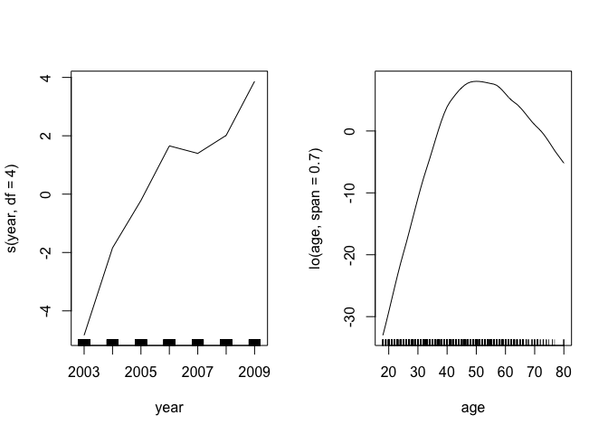<!-- -->

Now we use local regression to fit an interaction between year and ageby
a local regression surface, a 2d gaussian.

``` r
library(akima)
flo_interaction = as.formula(wage ~ lo(year,age,span = 0.5))
gam_interaction = gam::gam(formula = flo_interaction,data = d)
```

    ## Warning in lo.wam(x, z, wz, fit$smooth, which, fit$smooth.frame,
    ## bf.maxit, : liv too small. (Discovered by lowesd)

    ## Warning in lo.wam(x, z, wz, fit$smooth, which, fit$smooth.frame,
    ## bf.maxit, : lv too small. (Discovered by lowesd)

    ## Warning in lo.wam(x, z, wz, fit$smooth, which, fit$smooth.frame,
    ## bf.maxit, : liv too small. (Discovered by lowesd)

    ## Warning in lo.wam(x, z, wz, fit$smooth, which, fit$smooth.frame,
    ## bf.maxit, : lv too small. (Discovered by lowesd)

``` r
plot(gam_interaction)
```

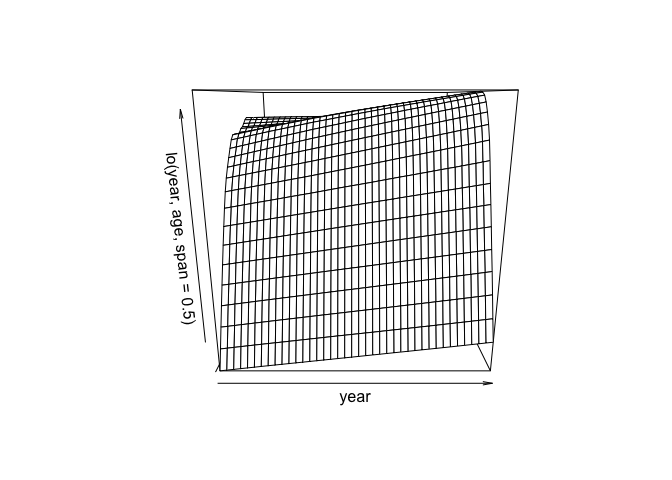<!-- -->

The same logic applies to logistic regression fits.
